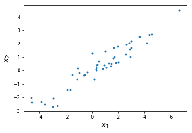
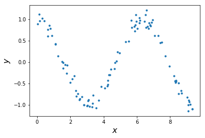
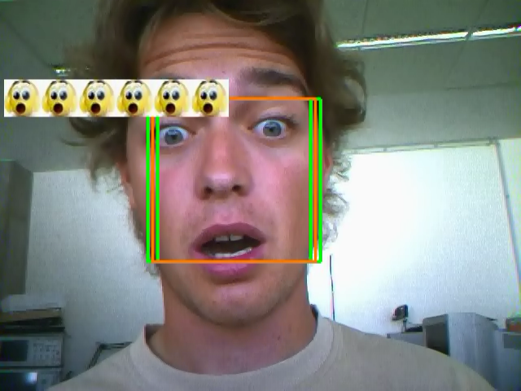
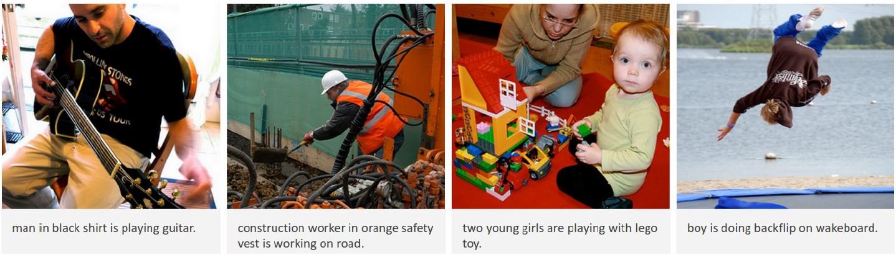
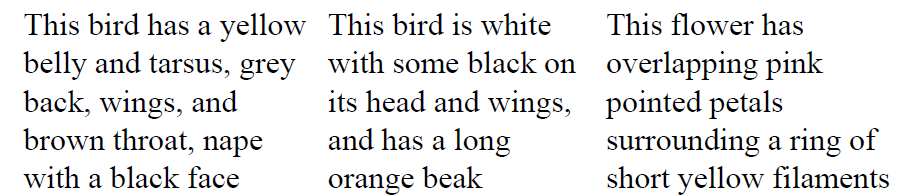
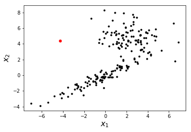
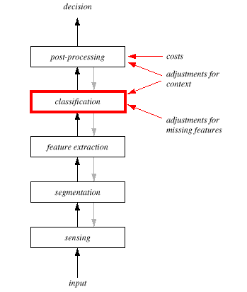
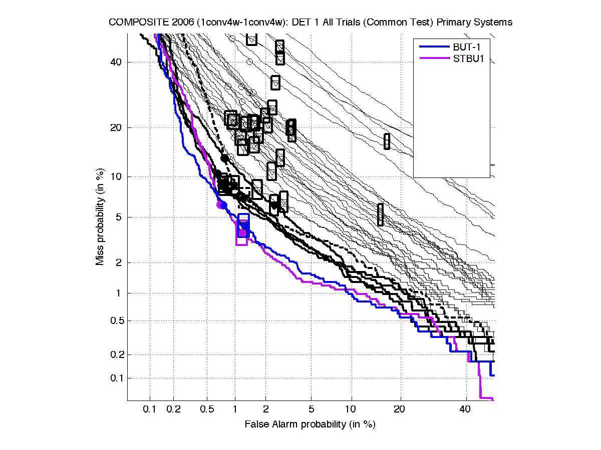
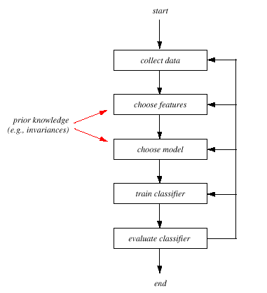

# SUR uvod

- Source: [SUR_uvod.pptx](../../../raw/sur-prednasky/01_uvod/SUR_uvod.pptx)
- URL: https://www.fit.vut.cz/study/course/SUR/public/prednasky/01_uvod/SUR_uvod.pptx

## Slide 1

Strojové učení a rozpoznávání

Úvod do problematiky

Luk áš   Burget

## Co je strojové učení ?

Tom M. Mitchell :  „ Říkáme, že počítačový program se učí ze zkušenosti  E   s ohledem na  n ějakou třídu úloh  T  a  nějaké měřítko úspěšnosti  P ,   pokud jeho se jeho úspěšnost měřená pomocí  P ,  zlepší se zkušeností   E .“

Typické  úlohy :

Příklady :

Prozpoznej slova v řečové nahrávce

Rozpoznej identitu člověka z obrázku obličeje

Přelož čeký text do Korejštiny

Klasifikuj objekt na základě změřené velikosti a váhy

Predikuj cenu akcií z údajů o hospodaření firmy

Typická reprezentace  zkušenosti :  Kolekce trenovacích vzorů (vstupy a / nebo výstupy) .

Typický způsob  měření úspěšnosti :  Konrola jak dobře řešíme úlohu na nových (testovacích) vstupech a požadovaných výstupech .

Model   /  Algoritmus

vstupní pozorování

(příznaky)

výstup

## Příklady vstupních pozorování I.

Řečová nahrávka – různě dlouhé sekvence numerických hodnot

Obrázek obličeje 100x100 pixelů – 3D matice  numerických hodnot (jedna dimenze pro barevný kanál)

Sekvence slov – různě dlouhé sekvence diskrétních symbolů

\[ 0.1, 1.5, 5.4, 5.2, 1.1, -2.3, -5.4, …, 0.8 \]

## Příklady vstupních pozorování II.

## Příklady vstupních pozorování III.

## Co je strojové učení ?  II.

Na daných trénovacích vzorech  ( vstupy a / nebo výstupy )  se učíme  zobrazit neviděné vstupy na požadované výstupy.

Příklady :

Na stovkách hodin řečových nahrávek s textovým přepsem se učíme automaticky přepsat nové řečové nahrávky.

Na datové sadě milionů obrazků lidských obličejů kde známe identitu člověka se učíme rozpoznat identitu člověka v nových obrázcích.

Hlavní typy učících se algoritmů

Učení s učitelem ( Supervised  L earning )

Trénovací vzory jsou dvojice vstupů a požadovaných výstupů

Typické úkoly :  klasifikace či obecně rozpoznávání vzoru ,  regrese , …

Učení bez učitele ( Unsupervised  L earning )

Trénovací vzory jsou pouze „neanotovaná“ (vstupní) data Typické úkoly: shlukování, detekce anomálií, odhad rozložení pravděpodobnosti, ...

Semi- supervizované učení ( Semi-supervised  learning)

Některé trénovací vzory jsou anotované dvojice vstup / výstum, ale pro některé (většinu) máme jen neonatované vstupy.

Posilované učení ( Reinforcement learning )

Parametry modelu jsou upravovány na základě pozitivního či negativního zpětné vazby po tom co uděláme serii rozhodnutí / akcí  ( např. na  konci vyhrané / prohrané hry, po (ne)uspěšné jízdě automaticky řízeným autem ) .

Příklady :  naučit řídit autonomní vozidlo, naučit  počítač hrát deskové či počítačové hry

## Učení s učitelem  ( Supervised  L earning )

Na trenovacích vzorech  ( barevné tečký )  se učíme přiřadit třídu  ( barvu )  novému před tím neviděnému vzoru  ( černá tečka )

## Učení s učitelem - příklady

Všechy předchozí příklady odpovídaly učení s učitelem

Classification:

Rozpoznej identitu člověka z obrázku obličeje

Klasifikuj objekt na základě změřené velikosti a váhy

Rozpoznej výraz v obličeji pro každý snímek videa

Regression:

Predikuj cenu akcií z údajů o hospodaření firmy

Predikuj počasí (teplotu, vlhkost, pravděpodobnost deště, ...) z historie meteorologických měření

More general pattern recognition problems

Prozpoznej slova v řečové nahrávce

Detekuj a klasifikuj všechny známe  (\>9 k )  objekty ve videu  https://youtu.be/MPU2HistivI

Odhadni pózu každého člověka ve videu    https://youtu.be/pW6nZXeWlGM

Other supervised learning problem

Přelož čeký text do Korejštiny  ( Strojový překlad,  Machine Translation)

Automatický popiš obrázek anglickým textem

Generuj  realistic ké   obrázky z  text ového popisu

## Učení s učitelem - příklady

Automatický popis obrázku anglickým textem

Kombinace konvoluční a rekurentní neuronové sítě

Andrej Karpathy, Li Fei-Fei: Deep Visual-Semantic Alignments for Generating Image Descriptions

## Supervised learning - examples

Generování  realistic kých   obrázků z  text ového popisu

Generativní kompetitivní neuronová sít (Generative Adversal Neural)

Han Zhang, et al.:  StackGAN : Text to Photo-realistic Image Synthesis with Stacked Generative Adversarial Networks.

## Učení bez učitele I.

Shlukování (Clustering) :  najdi shluky „podobných“ vstupních vzorů

V kolekci dokumentů najdi podobné dokumenty (stejné tema)

Zjisti kolik lidí mluví v nahrávce konverzace a kdo mluví kdy  ( diarizace )

Detekce anomalií :  detekuj neobvyklé vstupy  (outliers)

pro zamítnutí dalšího zpracování

abychom na ně upozornili jako na zajímavá nová data

## Učení bez učitele I.

Odhad rozložení pravděpodobnosti z dat

Uvidíme jak odhadnout parametry jednoduchých rozložení pravděpodobnosti  ( Gaussovské, Diskrétní, Směs Gaussovských rozložení )

S využívajícími hlubokých neuronových sítí můžeme modelovat (a generovat vzory ze) složitých rozložení  ( např. rozložení obrázků lidských tváří )

Diederik P. Kingma, Prafulla Dhariwal :  Glow: Generative Flow with Invertible 1x1 Convolutions

## Semisupervizované učení

Unannotated examples can help to find better decision boundary between classes

There is lots of unannotated data available on the internet

Text

Photos and other images

Speech and other recordings

...

## Jak postavi klasifikátor ?

## Jak takový klasifikátor pracuje ?

## Snímání

Co se dá o rozpoznávaných předmětech zjistit?

obraz, tlak, teplota, hmotnost, zvuk, pach ?

jak tyto veličiny prakticky získat, jde to vůbec a kolik to bude stát ?

- jaké vlastnosti bude mít snímač a převod veličin a  číslo ?

šum

linearita

kalibrace

stárnutí

atd.

## Extrakce příznaků

- Příznaky musí umožnit rozlišovat mezi třídami   musí být diskriminativní.

Předzpracování vstupu do následujícího klasifikátoru

Redukce dimenzí

Invariance vůči:

translace (mÍsto v obrázku, čas v řeči)

rotace

scale (velikost v obrázku, volume v řeči)

occlusion (zakrytí objektu vs. Maskování šumem)

projective distorition (úhel pohledu, optika)

rate (rychlost v řeči - intra- a inter-speaker variabilita)

deformace

atd.

Dekorelace…ale o tom ještě bude řeč v samostatné přednášce o příznacích.

## Extrakce příznaků

Bude průměr jablka / granátu dobrým příznakem?

-  Průměr  \[mm\]

<!-- -->

-  Četnost

## Extrakce příznaků

Gran áty

Jablka

-  Četnost  \[mm\]

<!-- -->

-  Podíl červené barvy  \[%\]

Nic moc, ale alespoň trochu lepší

Intuitivně už bychom mohli začít rozpoznávat, nastavením prahu tak aby bylo co nejvíce vzorů, které jsme zatím viděli rozpoznáno správně

## Extrakce příznaků

-  Četnost

<!-- -->

-  Váha  \[ dkg \]

Gran áty

Jablka

Když se tak díváme na histogramy příznaků, asi nás budou pro rozpoznávání zajímat jejich pravděpodobnostní rozložení      …ale to už zase předbíháme.

## Vícerozměrné příznaky

 Co když se podíváme na váhu a podíl červené barvy současně. Pro rozpoznávání to tady vypadá už docela nadějně.

-  Váha  \[ dkg \]

<!-- -->

-  Podíl červené barvy  \[%\]

 U jablek je váha korelovaná s červeností

Gran áty

Jablka

## Klasifikace

## Klasifikace

Jde nám o to je najít vhodnou  rozhodovací hranici  (decision boundary) přece oddělit vzorky jedné třídy od druhé.

…to se nám to krásně povedlo…ale možná to nebude to pravé

## Generalizace

V našem přikladu byly data náhodně vygenerovány z gaussovského rozložení. Pokud si takových dat „nasbíráme“ víc, už s našim výsledkem nebudeme tak spokojeni. Systém negeneralizuje na nová data.

## Lineární klasifikátor

Bohužel, rozpoznávání z takto vybraných příznaku nebude nikdy bez chyb, protože jejich rozložení se překrývají. Budeme tuto chybu chtít alespoň minimalizovat

Omezeni schopnosti detailně modelovat rozhodovací línii vedlo ke zlepšení generalizace. Oddělení tříd prostou přímkou nebo obecně hyper-rovinou teď vypadá o mnoho přijatelněji. O tom jak takovou rovinu určit bude samostatná přednáška.

## Kvadratická rozhodovací hranice

 V příští přednášce si ukážeme, že pro tento případ, kdy mají jednotlivé třídy gaussovské rozložení, dosáhneme nejlepší úspěšnosti při oddělení tříd kvadratickou křivkou.

## Algoritmus k-nejbližších sousedů ( K- nearest neighbors classifier)

- “ Neparametricky klasifikátor ”    nemá žádné parametry, které by bylo potřeba trénovat či odhadovat.
- Klasifikátor si pamatuje všechna “trénovací data“.

K nově klasifikovanému vzoru  ( černá tečka )  najde K nejbližších vzorů z trénovacích dat a vybere tu třídu, která je ve vybraných vzorech nejčastěji zastoupena.

-  Červenost

<!-- -->

-  Váha  \[ dkg \]

Můžu ale vůbec rovnávat váhu s červeností ?

Co když budu měřit váhu v tunách nebo miligramech

Prvně  bude  pot ř eba   obě  veli č iny  normalizovat – převézt do srovnatelného dinamického rozsahu

-  Váha  \[kg\]

Gran áty

Jablka

## 1-nejbližší soused

Opět problém z generalizací – podobná klikatá rozhodovací hranice.

## 3-nejbližší sousedé

O něco lepší výsledek. Zvýšení „počtu sousedů“ vede k vyhlazení rozhodovací hranice, přestože jsme model nijak nezjednodušili. Zde by se dalo mluvit o obdobě  regularizace  (viz další přednášky)

## 9-nejbližších sousedů

Rozhodovací linie už je dosti podobná optimální kvadratické křivce

## 9-nejbližších sousedů měkké rozhodnutí

Místo tvrdého rozhodnutí můžeme použít poměr mezi počtem sousedů z různých tříd jako „měkké“ měřítko důvěry (confidence), že vzor patří do té či oné třídy (pro K=9 máme pouze 10 úrovní).

## 31-nejbližších sousedů měkké rozhodnutí

## Post-processing

## Post-processing

Závislé na konkrétním úkolu.

Využití dalších kontextových informací jiných než je samotný vzor

Pokud je výstupem klasifikátoru měkké rozhodnutí, post-processing se může přiklonit jedné variantě než té s nejlepším skóre:

např. integrace apriorní pravděpodobnosti (viz další přednáška)

Můžeme brát v úvahu  ceny  jednotlivých rozhodnutí. Co nás bolí víc? Poslat jablko pyrotechnikovi nebo granát do marmeládovny.

- Rozhodnutí pro konkrétní třídu pokud její skóre překročí jistý práh   Detekční úloha

## Identifikace vs. detekce

- Identifikace  vyber jednu z N možných tříd
- V příchozích vzorech detekuj ty, které paří do třídy, kterou hledáme.

<!-- -->

- Vzory, které detekovat nechceme nemusí patřit do omezeného tříd (např. v telefonních hovorech hledáme hlas konkrétního mluvčího mezi hlasy všech možný mluvčích)
- Detekci proveď na základě  měkkého rozhodnuti  –  skóre  – a nastaveného  prahu .
- Detekční práh je možné měnit podle požadované aplikace:

<!-- -->

- Práh nastavený nízko  Hodně detekcí ale také hodně planých poplachů
- Práh nastavený vysoko    opačný problém

## Detection tradeoff  (DET) křivka

## Slide 37

## The Design Cycle

Data Collection

	How do we know when we have collected an adequately large and representative set of examples for training and testing the system?

Feature Choice

	Depends on the characteristics of the problem domain. Simple to extract, invariant to irrelevant transformation insensitive to noise.

Model Choice

	Unsatisfied with the performance of our fish classifier and want to jump to another class of model

Training

	Use data to determine the classifier. Many different procedures for training classifiers and choosing models

Evaluation

	Measure the error rate (or performance and switch from one set of features to another one
