# bayesovska teorie

- Source: [bayesovska_teorie.pptx](../../../raw/sur-prednasky/02_bayesovska_teorie/bayesovska_teorie.pptx)
- URL: https://www.fit.vut.cz/study/course/SUR/public/prednasky/02_bayesovska_teorie/bayesovska_teorie.pptx

## Slide 1

Strojové učení a rozpoznávání

Bayesovská rozhodovací teorie

Luk áš   Burget

## Extrakce příznaků

-  Četnost

<!-- -->

-  Váha  \[ dkg \]

Gran áty

Jablka

## Pravděpodobnosti - diskrétní příznaky

Uvažujme diskrétní příznaky – „váhové kategorie“

Nechť tabulka  reflektuje skutečné pravděpodobnosti  jednotlivých kategorií

| 1 | 6 | 12 | 15 | 12 | 2 | 2 | 50 |
|----|----|----|----|----|----|----|----|
| 4 | 23 | 50 | 14 | 6 | 3 | 1 | 100 |
| nejlehčí 0.0 - 0.1 | lehčí 0.1 - 0.2 | lehký 0.2 - 0.3 | střední 0.3 – 0.4 | těžký 0.4 – 0.5 | těžší 0.5 – 0.6 | nejtěžší 0.6   –   0.7 | \[kg\] |

## Apriorní pravděpodobnost – Stav věci

Hádej co mám za zády, jablko nebo granát?

Klasifikační pravidlo:

Vyber čeho je nejvíc

Třída s největší apriorní pravděpodobností (a-priori probability)

| 1 | 6 | 12 | 15 | 12 | 2 | 2 | 50 |
|----|----|----|----|----|----|----|----|
| 4 | 23 | 50 | 14 | 6 | 3 | 1 | 100 |
| nejlehčí 0.0 - 0.1 | lehčí 0.1 - 0.2 | lehký 0.2 - 0.3 | střední 0.3 – 0.4 | těžký 0.4 – 0.5 | těžší 0.5 – 0.6 | nejtěžší 0.6   –   0.7 | \[kg\] |

## Společná pravděpodobnost

Je to těžké. Hádej co to je?

Klasifikační pravidlo:

Ve sloupci váhové kategorie vyber nejčastější třídu

Třída s největší společnou pravděpodobností ( joint probability ) – pravděpodobnost  chlívečku.

… ale také největší podmíněnou pravděpodobností (viz další slajd)

| 1 | 6 | 12 | 15 | 12 | 2 | 2 | 50 |
|----|----|----|----|----|----|----|----|
| 4 | 23 | 50 | 14 | 6 | 3 | 1 | 100 |
| nejlehčí 0.0 - 0.1 | lehčí 0.1 - 0.2 | lehký 0.2 - 0.3 | střední 0.3 – 0.4 | těžký 0.4 – 0.5 | těžší 0.5 – 0.6 | nejtěžší 0.6   –   0.7 | \[kg\] |

## Podmíněná pravděpodobnost

Je to těžké.  S  jakou pravděpodobností je to granát?

Podmíněnou pravděpodobnost   ( conditional probability ) - pravděpodobnost  chlívečku dáno sloupec

| 1 | 6 | 12 | 15 | 12 | 2 | 2 | 50 |
|----|----|----|----|----|----|----|----|
| 4 | 23 | 50 | 14 | 6 | 3 | 1 | 100 |
| nejlehčí 0.0 - 0.1 | lehčí 0.1 - 0.2 | lehký 0.2 - 0.3 | střední 0.3 – 0.4 | těžký 0.4 – 0.5 | těžší 0.5 – 0.6 | nejtěžší 0.6   –   0.7 | \[kg\] |

## Ještě nějaké další pravděpodobnosti

| 1 | 6 | 12 | 15 | 12 | 2 | 2 | 50 |
|----|----|----|----|----|----|----|----|
| 4 | 23 | 50 | 14 | 6 | 3 | 1 | 100 |
| nejlehčí 0.0 - 0.1 | lehčí 0.1 - 0.2 | lehký 0.2 - 0.3 | střední 0.3 – 0.4 | těžký 0.4 – 0.5 | těžší 0.5 – 0.6 | nejtěžší 0.6   –   0.7 | \[kg\] |

## Bayesův teorém

Věrohodnost nás zatím moc nezajímala, ale za chvíli to bude  to  hlavní co se budeme snažit odhadovat z trénovacích dat.

Již dříve jsme viděli že ( product rule ):

Pro evidenci platí ( sum rule ):

např.:

Posteriorní pravděpodobnost

( posterior probability )

Věrohodnost

( likelihood )

Apriorní pravděpodobnost

( prior probability )

Evidence

## Maximum a-posteriori (MAP) klasifikátor

Mějme 2 třídy  ω 1  a  ω 2

Pro daný příznak  x  vyber třídu  ω  s větší posteriorní pravděpodobností  P ( ω \| x )

Vyber  ω 1   pouze pokud :

## Maximum a-posteriori (MAP) klasifikátor

Pro každé x minimalizuje pravděpodobnost chyby:

	P(chyby\|x) = P( ω 1 \|x) pokud vybereme  ω 2

	P(chyby\|x) = P( ω 2 \|x) pokud vybereme  ω 1

- 	Pro dané x vybíráme třídu  ω  s větším P( ω \|x)     minimalizace chyby

Musíme ovšem znát

P( ω \|x )

nebo  P( x, ω )

nebo  P( x \| ω )  a  P( ω ) ,

	které reflektují skutečná rozložení  pro  rozpoznávaná data

Obecně pro N tříd

Vyber  třídu s největší posteiorní pravděpodobností :

## Spojité příznaky

Bude nás zajímat funkce rozložení pravděpodobnosti příznaků podmíněné třídou

P (.)  – bude pravděpodobnost

p (.)  – bude hodnota funkce rozložení pravděpodobnosti

3.5

0

- Plocha pod funkci musí být 1
- Hodnoty mohou být ale libovolné kladné

0.7  \[ kg \]

## Bayesův teorém – spojité příznaky

-    x

<!-- -->

-    x

<!-- -->

-    x

0

1

0

2.5

3.5

0

## MAP klasifikátor – spojité příznaky

Opět se budeme rozhodovat podle:

	nebo

0

Na obrazcích vidíme, že obě pravidla vedou ke stejným rozhodnutím

1

## MAP klasifikátor – pravděpodobnost chyby

Říkali jsme, že MAP klasifikátor minimalizuje pravděpodobnost chyby

Plocha pod funkci společného rozložení pravděpodobnosti p( ω,x ) v určitém intervalu x je pravděpodobnost výskytu vzoru třídy  ω s příznakem v daném intervalu

Jaká je tedy celková pravděpodobnost, že klasifikátor udělá chybu ?

-    x

0

2.5

Jakákoli snaha posunout hranice povede jen k větší chybě

- 

-    x

0

2.5

- 

Pravděpodobnost, že červená třída je chybně klasifikována jako   modrá

## Posteriorní pravděpodobnosti pro různé apriorní pravděpodobnosti

Změna apriorních pravděpodobností tříd může vézt k různým rozhodnutím

-    x

-    x

<!-- -->

-    x

## Vícerozměrné příznaky

Místo jednorozměrného příznaku máme  N  rozměrný příznakový vektor

x   =   \[ x 1,  x 2, …,  x N \]

např.  \[ váha, červenost \]

MAP klasifikátor opět vybírá nejpravděpodobnější třídu

- 

<!-- -->

-  x 2

<!-- -->

-  x 1

## Parametrické modely

Pro rozpoznávání s MAP klasifikátorem jsme doposud předpokládali, že známe skutečná rozloženi

P ( ω \| x )

nebo  p ( x , ω )

nebo  p ( x \| ω )  a  P ( ω )

Ve skutečnosti ale většinou známe jen trénovací vzory

Pokusíme se tato rozložení odhadnout z dat – budeme trénovat statistické modely

## Parametrické modely

Můžeme se pokusit modelovat přímo posteriorní pravděpodobnost, a tu použít přímo k rozpoznávání  P ( ω \| x )

tzv.  diskriminativní trénování

Ale o tomto bude řeč až později

Běžnější je odhadovat rozložení  p ( x \| ω )  a  P( ω )

Tato rozložení popisují předpokládaný proces generování dat –  generativní modely

Nejprve se musíme rozhodnout pro formu modelu, který použijeme (např. gaussovské rozložení)

Švestky

## Gaussovské rozložení  (jednorozměrné)

## Pro č gaussovské rozložení ?

Přirozeně se vyskytuje

Central ní  limit ní   teorém :  Sečtení hodnot mnoha bezávysle vygenerovaných nahodných čísel nám da vzorek z Gaussova rozložení

Příklady :

Sečtení hodnot z N hracích kostek

Galton’s board https://www.youtube.com/watch?v=03tx4v0i7MA

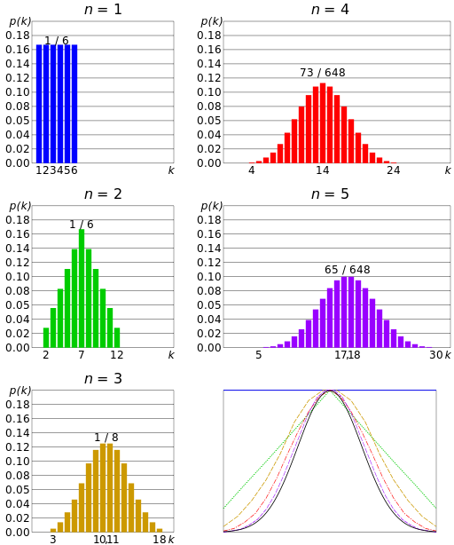

## Pro č gaussovské rozložení ?

Postačující statistiky

(Sufficient statistics)

## Gaussovské rozložení (vícerozměrné)

## Příklady dvourozměrných gaussovek

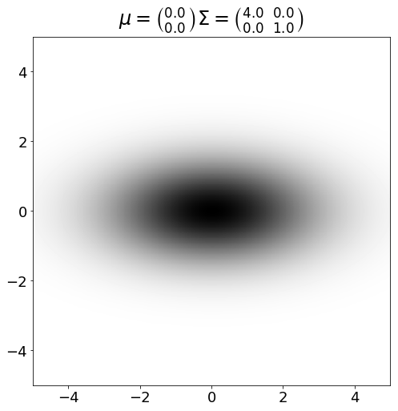

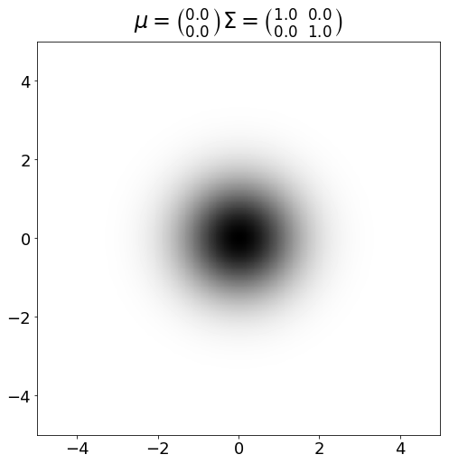

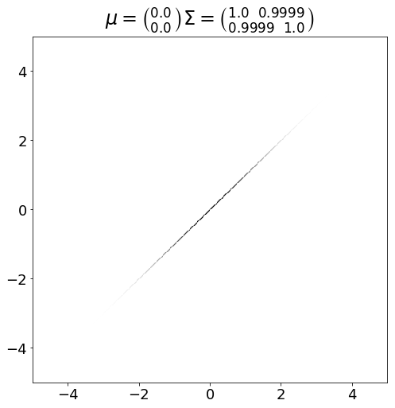

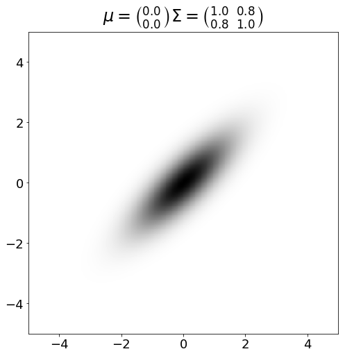

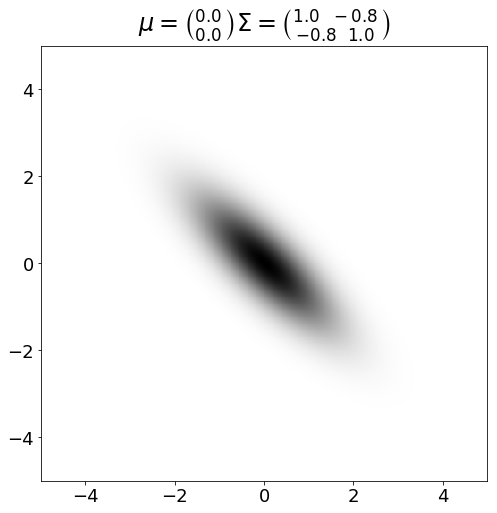

## Kvadratické funkce  ( dvourozměrné )

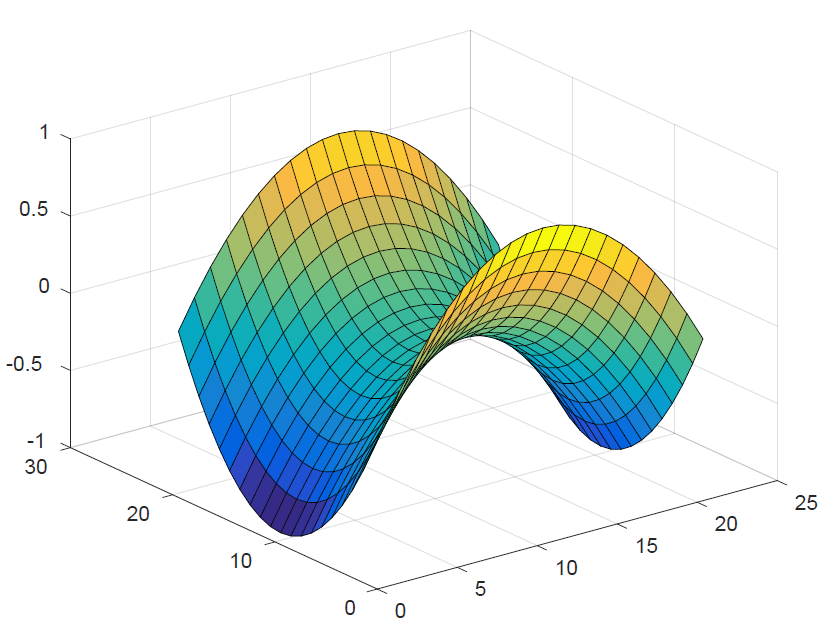

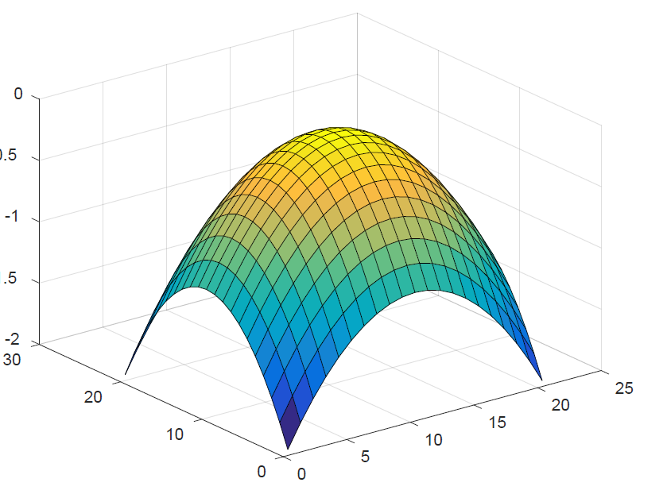

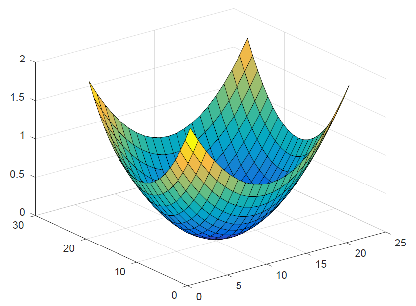

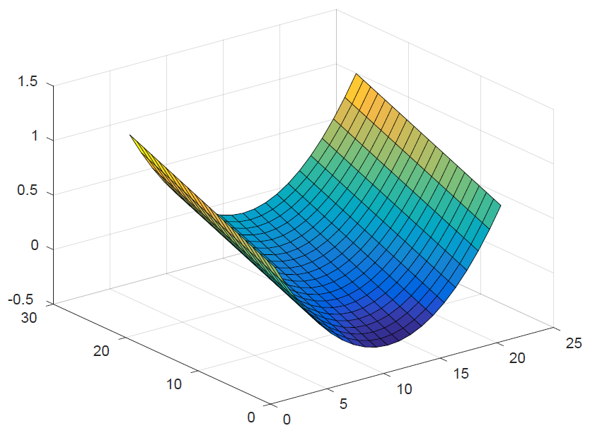

Positivně definitní

Negativně definitní

Positivně semidefinitní

Indefinitní

## Odhad parametrů rozložení s maximální věrohodností

## Pro č odhad s maximální věrohodností

## Ještě jednou : Pro č gaussovské rozložení ?

Postačující statistiky

(Sufficient statistics)

## ML  odhad pro Gaussovku

and similarly:

Postačující statistiky

(Sufficient statistics)

## ML  odhad pro Gaussovku

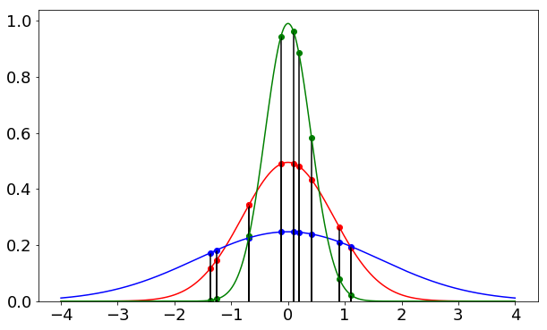

Černé svislé čary představují trénovací vzory (pozorování)

Červena gaussovka odpovídá maximálně věrohodnému odhadu  maximum   likelihood estimate

Násobek výšek červených teček bude největší možné číslo

## Gaussovské rozložení ( vícerozměrné )

ML odhad of parametrů:

## Diskrétní rozložení

| 0.5 | 0.3 | 0.2 |
|-----|-----|-----|

## ML  odhad pro diskrétní rozložení

## Gaussovský klasifikátor  – 2D  data

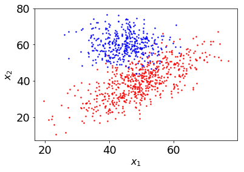

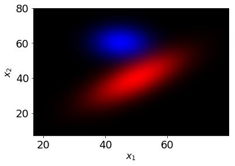

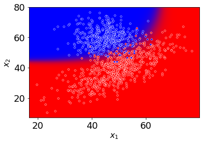

## Gaussian classifier – more classes

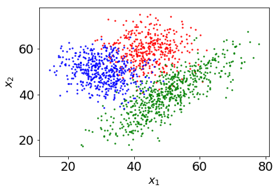

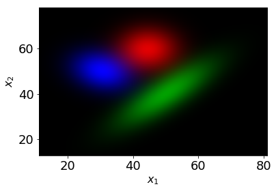

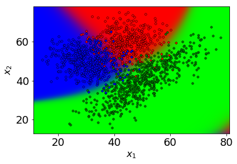

## Slide 35

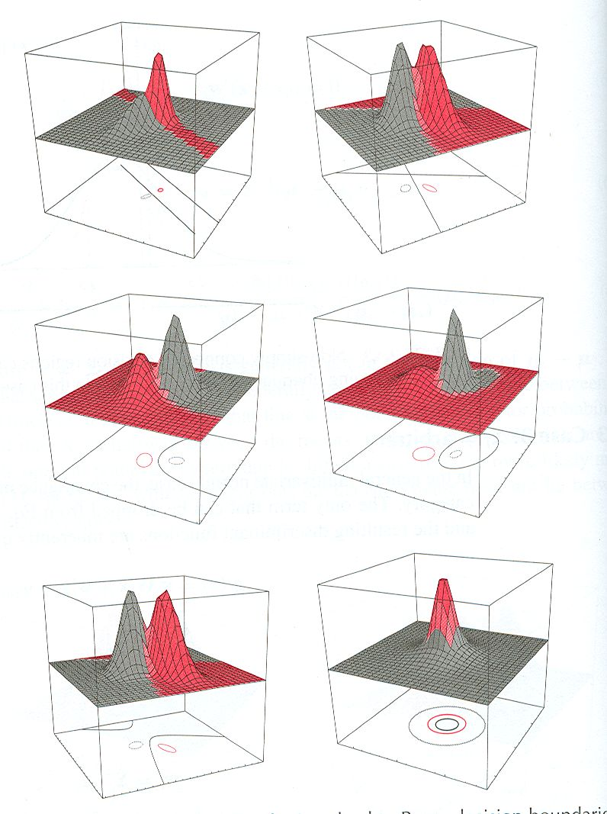

## Slide 36

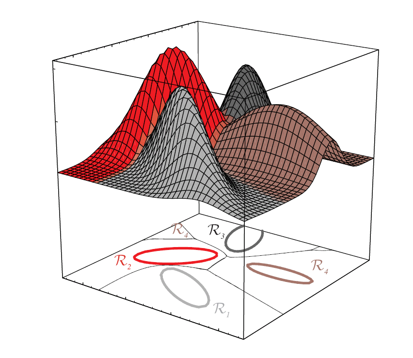

## Směs gaussovských rozložení (Gaussian Mixture Model –  GMM )

kde

## Směs gaussovských rozložení

Vzoreček můžeme chápat jen jako něco co definuje tvar funkce hustoty pravděpodobnosti…

nebo jej můžeme vidět jako složitější generativní model,který generuje příznaky následujícím způsobem:

Napřed je jedna z gaussovských komponent vybrána tak aby respektovala apriorní pravděpodobnosti  P c

Příznakový vektor se generuje z vybraného gaussovského rozložení.

Pro vyhodnoceni modelu ale nevíme, která komponenta příznakový vektor generovala a proto musíme marginalizovat (suma přes gaussovské komponenty násobené jejich  “ apriorními ”  pravděpodobnostmi)

## Trénování  GMM –   Viterbi training

Intuitivní ale nepřesný iterativní algoritmus pro ML trénování GMM parametrů

## Trénování  GMM –   Viterbi training

Intuitivní ale nepřesný iterativní algoritmus pro ML trénování GMM parametrů

- Současným modelem klasifikujeme data jako kdyby by jednotlivé Gaussovky modelovaly různé třídy a váhy byly apriorní pravděpodobnosti tříd  ( přesto, že všechnadata patří do jedné třídy, kterou se snažíme modelovat ) .

## Trénování  GMM –   Viterbi training

Intuitivní ale nepřesný iterativní algoritmus pro ML trénování GMM parametrů

- Současným modelem klasifikujeme data jako kdyby by jednotlivé Gaussovky modelovaly různé třídy a váhy byly apriorní pravděpodobnosti tříd  ( přesto, že všechnadata patří do jedné třídy, kterou se snažíme modelovat ) .

<!-- -->

- Nové parametry každé Gaussovky odhadneme na datech k ní přiřazených v předchozím kroku. Nové váhy jsou dány poměry možství dat přiřazených Gausovkám.

## Trénování  GMM –   Viterbi training

Intuitivní ale nepřesný iterativní algoritmus pro ML trénování GMM parametrů

- Současným modelem klasifikujeme data jako kdyby by jednotlivé Gaussovky modelovaly různé třídy a váhy byly apriorní pravděpodobnosti tříd  ( přesto, že všechnadata patří do jedné třídy, kterou se snažíme modelovat ) .

<!-- -->

- Nové parametry každé Gaussovky odhadneme na datech k ní přiřazených v předchozím kroku. Nové váhy jsou dány poměry možství dat přiřazených Gausovkám.

<!-- -->

- Předchozí dva kroky opakujeme až do konvergence.

## Trénování  GMM – EM algorithm
