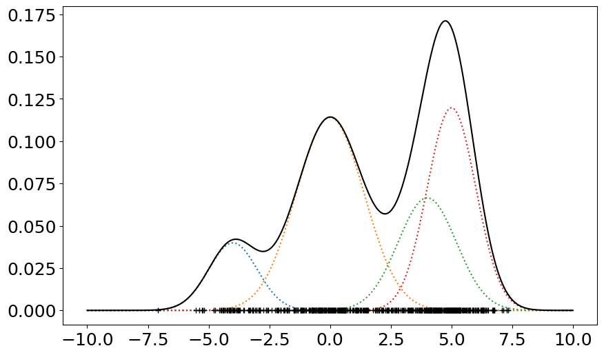
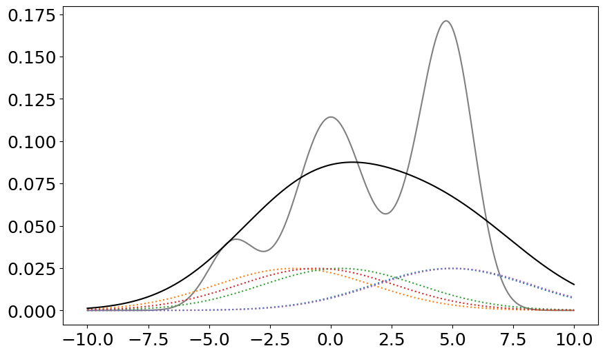
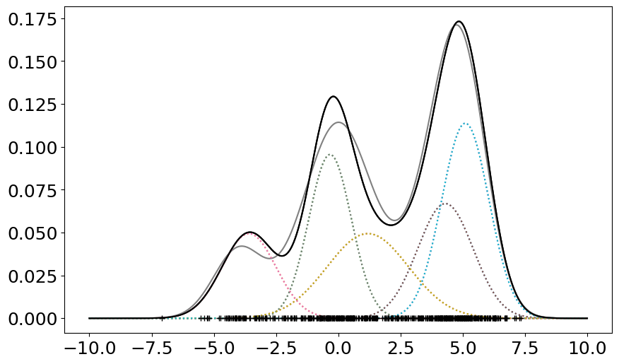
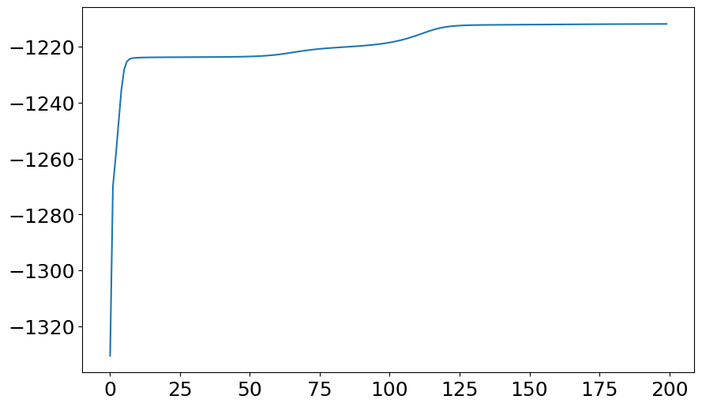

# ml training of gmm

- Source: [ml_training_of_gmm.ipynb](../../../raw/sur-prednasky/02_bayesovska_teorie/ml_training_of_gmm.ipynb)
- URL: https://www.fit.vut.cz/study/course/SUR/public/prednasky/02_bayesovska_teorie/ml_training_of_gmm.ipynb

<div class="cell code" execution_count="1">

``` python
import numpy as np
import scipy.stats as sps
import matplotlib.pyplot as plt
from scipy.special import logsumexp
#%matplotlib qt5
%matplotlib inline
plt.rcParams.update({'figure.figsize': (10.0, 6.0), 'font.size': 18})
```

</div>

<div class="cell markdown" collapsed="true">

## Gaussian Mixture Model (GMM)

- probability density finction
  ``` math
  \large
  \DeclareMathOperator{\Norm}{\mathcal{N}}
  \DeclareMathOperator{\Gam}{Gam}
  \DeclareMathOperator{\e}{exp}
  p(x|\{\mu_c\}, \{\sigma_c^2\}, \{\pi_c\}) = \sum_{c=1}^{C} \Norm(x|\mu_c, \sigma^2_c) \pi_c
  ```

where

- $`\{\mu_c\}`$ is the set of $`C`$ means
- $`\{\sigma_c^2\}`$ is the set of $`C`$ variances
- $`\{\pi_c\}`$ is set of $`C`$ weights such that $`\sum_{c=1}^C \pi_c = 1`$

and single variate Gasussian distribution

``` math
\large
p(x \mid \mu, \sigma^2) = \Norm(x \mid \mu, \sigma^2) = \frac{1}{\sqrt{2\pi\sigma^2}} \e\left\{ \frac{-(x - \mu)^2}{2\sigma^2} \right\}
```

</div>

<div class="cell code" execution_count="233">

``` python
# Plot GMM pdf together with the individual components pdfs; return the GMM pdf line
def plot_GMM(t, mus, sigmas, pis):
  p_xz = sps.norm.pdf(t[:,np.newaxis], mus, sigmas) * pis # all GMM components are evaluated at once
  px = np.sum(p_xz, axis=1)
  plt.plot(t, p_xz, ':')
  plt.plot(t, px, 'k')
  return px

#Handcraft some GMM parameter
mus = [-4.0, 0.0, 4.0, 5]
sigmas = [1.0, 1.4, 1.2, 1]
pis = [0.1, 0.4, 0.2, 0.3]

t = np.linspace(-10,10,1000)
true_GMM_pdf = plot_GMM(t, mus, sigmas, pis)

# Generate N datapoints from this GMM
N = 500
Nc = sps.multinomial.rvs(N, pis) # Draw observation counts for each component from multinomial distribution
x = sps.norm.rvs(np.repeat(mus, Nc), np.repeat(sigmas, Nc))
np.random.shuffle(x)
plt.plot(x, np.zeros_like(x), '+k');
```

<div class="output display_data">



</div>

</div>

<div class="cell markdown">

## GMM - EM algorithm

- E-step

``` math
\large
\DeclareMathOperator{\Norm}{\mathcal{N}}
\DeclareMathOperator{\eeta}{\boldsymbol{\eta}}
\gamma_{nc}=P(z_n=c|x_n,\eeta^{old})=\frac{p(x_n|z_n=c,\eeta^{old})P(z_n=c|\eeta^{old})}{p(x_n|\eeta^{old})}
=\frac{\mathcal{N}(x_n|\mu_c^{old}{\sigma_c^2}^{old})\pi_c^{old}}{\sum_{k}\mathcal{N}(x_n|\mu_{k}^{old},{\sigma_{k}^2}^{old})\pi_{k}^{old}}
```

- M-step

``` math
\large
\begin{align}
\mu_c^{new}        & =\frac{\sum_n \gamma_{nc}x_n}{\sum_n \gamma_{nc}}\\
{\sigma_c^2}^{new} & =\frac{\sum_n \gamma_{nc}(x_n-\mu_c^{new})^2}{\sum_n \gamma_{nc}}\\
\pi_c              & =\frac{\sum_n \gamma_{nc}}{N}
\end{align}
```

</div>

<div class="cell code" execution_count="237" scrolled="false">

``` python
#Choose some initial parameters
C = 5        # number of GMM components
mus = x[:C]  # we choose few first observations as the initial means
sigmas = np.repeat(np.std(x), C) # sigma for all components is set to std of the the training data
pis = np.ones(C)/C

plt.clf()
plt.plot(t, true_GMM_pdf, 'gray')
plot_GMM(t, mus, sigmas, pis);
log_p_X = []
```

<div class="output display_data">



</div>

</div>

<div class="cell code" execution_count="238" scrolled="false">

``` python
for _ in range(200):
  #E-step
  log_p_xz = sps.norm.logpdf(x[:,np.newaxis], mus, sigmas) + np.log(pis)
  log_p_x = logsumexp(log_p_xz, axis=1, keepdims=True)
  log_p_X.append(log_p_x.sum())
  #print("Training data log likelihood:", log_p_x.sum())

  gammas = np.exp(log_p_xz - log_p_x)
  #M-step
  Nc = gammas.sum(axis=0)
  mus =  x.dot(gammas) / Nc
  sigmas =  np.sqrt((x**2).dot(gammas) / Nc - mus**2) # we use std, not variance!
  pis = Nc / Nc.sum()

plot_GMM(t, mus, sigmas, pis)

#plt.clf()
plt.plot(t, true_GMM_pdf, 'gray')
plot_GMM(t, mus, sigmas, pis);
plt.plot(x, np.zeros_like(x), '+k');
```

<div class="output display_data">



</div>

</div>

<div class="cell code" execution_count="239">

``` python
plt.plot(log_p_X)
print(pis, mus, sigmas)
```

<div class="output stream stdout">

    [0.18689253 0.13405782 0.20502273 0.20297895 0.27104798] [ 4.3039673  -3.58518574 -0.32917272  1.1866124   5.10402991] [1.11521868 1.08337966 0.85662146 1.64062334 0.95108969]

</div>

<div class="output display_data">



</div>

</div>
