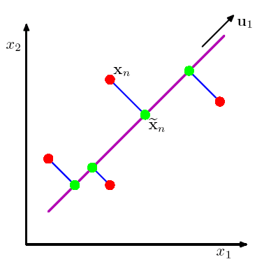
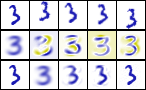
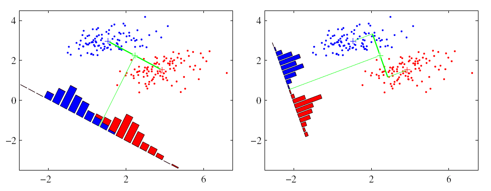
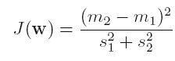
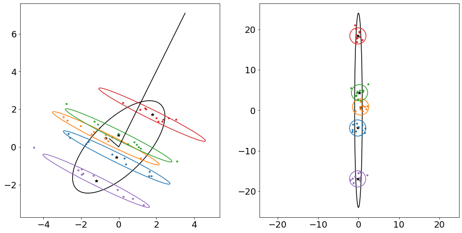
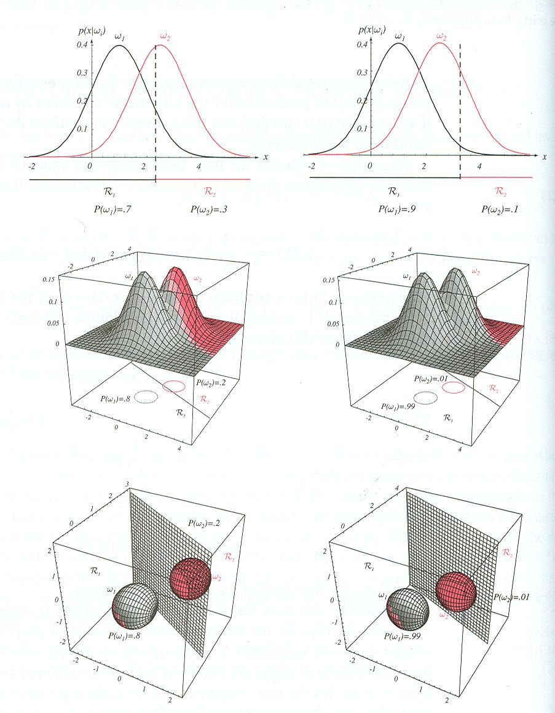
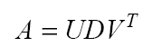
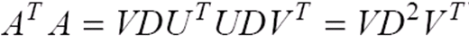
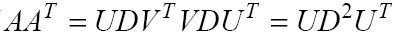

# extrakce priznaku

- Source: [extrakce_priznaku.pptx](../../../raw/sur-prednasky/03_extrakce_priznaku/extrakce_priznaku.pptx)
- URL: https://www.fit.vut.cz/study/course/SUR/public/prednasky/03_extrakce_priznaku/extrakce_priznaku.pptx

## Klasifikace a rozpoznávání

Extrakce příznaků

## Extrakce příznaků - parametrizace

Poté co jsme ze snímače obdržely data která jsou relevantní pro naši klasifikační úlohu, je potřeba je přizpůsobit potřebám rozpoznávače

Klasifikátory mají rády parametry které jsou:

Gaussovského rozložení (většinou vícerozměrného)

Nekorelované

Nízkodimenzionální

## Příklad parametrizace pro 2D vstupní vektory

Mějme vzorky (příklady) 2D rozložení pro dvě třídy.

## Příklad parametrizace pro 2D vstupní vektory

Rozložení není příliš gau s sovské.

Provedeme třetí odmocninou obou koeficientů.

## Příklad parametrizace pro 2D vstupní vektory

Prostor se komprimuje – nelineárně deformuje...

## Příklad parametrizace pro 2D vstupní vektory

... a rozložení pro každou třídu je nyní gaussovské.

Koeficienty jsou ale korelované.

Je vhodné prostor otočit tak aby se koeficienty dekorelovaly.

## Příklad parametrizace pro 2D vstupní vektory

Nyní jsou koeficienty dekorelovány.

Svislá dimenze je navíc zbytečná, protože třídy se v ní zcela překrývají.

## Gauss ovské rozložení  ( jednorozměrné )

ML odhad parametrů (Trénování):

Evaluation:

## Gaussovské rozložení ( vícerozměrné )

ML odhad of parametrů:

## Plná a diagonální kovarianční matice

## Diagonální kovarianční matice

## Diagonální kovarianční matice

Koeficienty x i  příznakového vektoru  x  jsou statisticky nezávislé.

## Diagonální kovarianční matice

## Skalární součin

## Rotace vektoru

## Projekce vektoru

## Vlastní čísla a vektory

## Slide 18

## Slide 19

## Analýza hlavních komponent

(Principal Component Analysis - PCA)

## Analýza hlavních komponent

Umožňuje:

Dekorelaci – vlastní vektory kovarianční matice definuji souřadný systém ve kterých jsou data dekorelována – mají diagonální kovarianční matici

Redukci dimenzí – promítnutí dat do pouze několika vlastních vektorů odpovídajících největším vlastním číslům (směry s nevětší variancí) umožní optimální rekonstrukci dat s nejmenší kvadratickou chybou ( mean square error - MSE )

Redukce dimenzí provádíme pokud věříme, že v některých směrech není užitečná informace ale pouze (gaussovský) šum s nízkou variabilitou.

## Interpretace  Σ  v  gaussovském rozložení

## PCA - Příklad

Obrázky 100x100 pixelů   –  10000  dimensionální vektory

μ           λ 1 =3.4∙10 5     λ 2 =2.8∙10 5    λ 3 =2.4∙10 5     λ 3 =1.6∙10 5

Střední hodnota, vlastní čísla a vlastní vektory

Střední hodnota, vlastní čísla a vlastní vektory

Originál          M  = 1           M=10          M=50      M=250

## PCA - Příklad

Jakou dimenzi si PCA vybere na tomto příkladě?

Bude to výhodné pro klasifikaci tříd?

## Lineární diskriminační analýza

Opět se pokusíme promítnout data pouze do určitého směru:

Tentokrát ale budeme chtít aby v tomto směru byly separovány třídy.

Intuitivně by nás mohlo napadnout vybrat směr ve kterém jsou nejlépe odděleny průměty středních hodnot tříd  m 1  a  m 2 . Hledáme tedy  w , které maximalizuje:

m 1

m 2

## Lineární diskriminační analýza

Lze však najít i lepší směr:

Snažíme se data promítnout do takového směru, kde

Maximalizujeme  ( čtverec )  vzdálenosti mezi středními hodnotami tříd

Nebo-li  varianci   mezi  t ří dami

Minimalizujeme průměrnou varianci tříd

 Maximalizujeme tedy

## Lineární diskriminační analýza

## Lineární diskriminační analýza

## Lineární diskriminační analýza

## Lineární diskriminační analýza

## Lineární diskriminační analýza

## LDA a lineární klasifikátor

	Dvě třídy s gaussovským rozložením se stejnou kovarianční matici jsou opravdu optimálně oddělitelné lineárním klasifikátorem (přímkou, rovinou, hyper-rovinou)

## Extrakce příznaku pro řeč - MFCC ( Mel frequency cepstral coefficients )

Nejprve řečový signál rozdělíme do asi 20ms překrývajících se segmentů

## Slide 34

## Slide 35

Logaritmický vystup z banky filtru – je třeba již jen dekorelovat

Původní signál

## Slide 36

## Singular Value Decomposition - SVD

A  je jakákoli mxn matice

U  je mxn matice kde sloupce jsou ortonormální báze

V  je nxn matice kde sloupce jsou ortonormální báze

D  je nxn je diagonální matice

- Předpokládejme, že matice A je matice s příznakovými vektory v řádcích s již odečtenou střední hodnotou     Σ  =  A T A

Potom z následujících vztahů vyplývá, ze:

V  jsou vlastní vektory  Σ

Diagonála  D  obsahuje odmocniny z vlastních čísel  Σ  (variance ve směrech vlastních vektorů)
