# lin klasifikatory

- Source: [lin_klasifikatory.pptx](../../../raw/sur-prednasky/04_lin_klasifikatory/lin_klasifikatory.pptx)
- URL: https://www.fit.vut.cz/study/course/SUR/public/prednasky/04_lin_klasifikatory/lin_klasifikatory.pptx

## Slide 1

Strojové učení a rozpoznávání

Lineární klasifikátory

Luk áš   Burget

Duben  2026

## Opakování - Skalární součin

.

## Lineární klasifikátor

Zobecněný lineární klasifikátor

## Lineární klasifikátor

## Perceptron

## Perceptron – učící algoritmus

## Slide 7

## Perceptron

D

R

Nejvzdálenější bod od počátku

SVM řešení

Algoritmus konverguje v méně než  ( R /D) 2  krocích

## Opakování - MAP klasifikátor

## Pravděpodobnostní generativní model

## Slide 11

## M aximum likelihood   odhad parametrů

## Slide 13

V případě kdy ovšem naše data nerespektují předpoklad gaussovských rozložení a sdílené kovarianční matice. Klasifikátor může selhat – fialová rozhodovací linie

Lepší výsledky dostaneme s diskriminativně natrénovaným klasifikátorem, který bude vysvětlen později – zelená rozhodovací linie

## Opakování LDA

Snažíme se data promítnout do takového směru, kde

 Maximalizujeme vzdálenost mezi středními hodnotami tříd

 Minimalizujeme průměrnou varianci tříd

 Maximalizujeme tedy

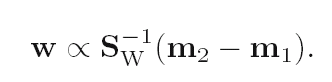

## Generativní model a zobecněny lineární klasifikátor

## Jiné generativní lineární klasifikátory

## Problém s více třídami

Klasifikace

jeden proti všem

Každý s každým

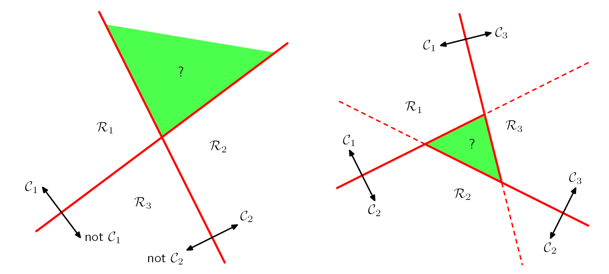

## Lineární klasifikátor – více tříd

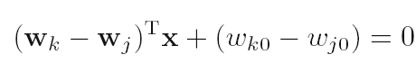

## Gaussovský lineární klasifikátor pro více tříd

funkce

softmax

Konstanta ,  která nezáleží na třídě. Vykrátila by se ve funkci softmax a tedy ji nemusíme vůbec počítat

## Odvození

## Softmax   funkce

Funkce vrací vektor hodnot

( pravděpodobností )

Vstupem softmax funkce je vektor

Převede  vector  logaritmu nenormalizovaných pravděpodobností tříd na   pravděpodobnosti tříd

## Gaussovský lineární klasifikátor pro více tříd  II

## Lineární logistická regrese   pro více tříd

## Lineární logistická regrese  – II.

## Lineární logistická regrese  – III.

## M etod a  gradientního sestupu

## softmax   pro  2  třídy

## Lineární logistická regrese  –  2 třídy

## Lineární logistická regrese  –  2 třídy – II.

## Lineární logistická regrese  –  2 třídy – III.

## M etod a  gradientního sestupu

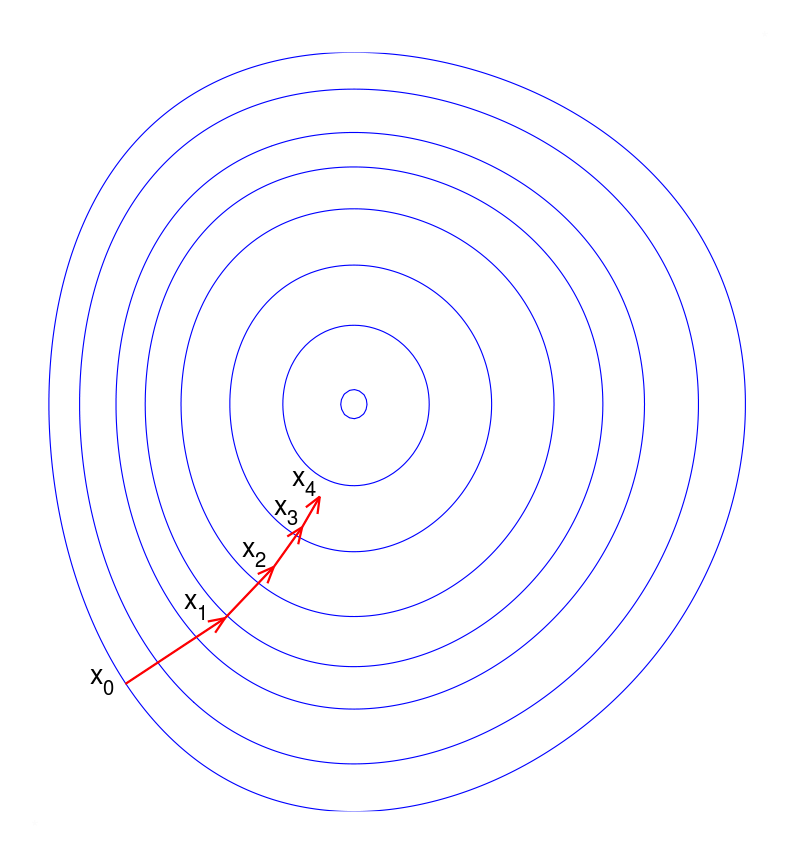

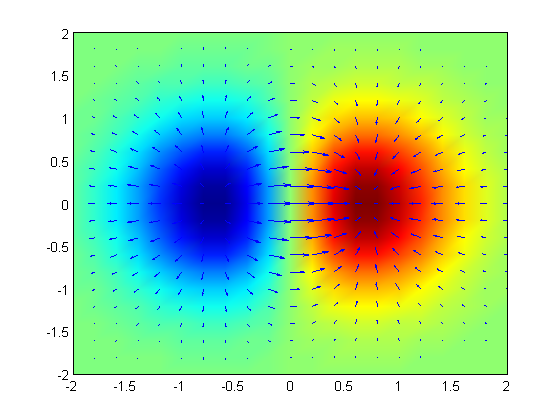

## Lineární logistická regrese :   odhad parametrů

## L ogistická regrese  –  příklad

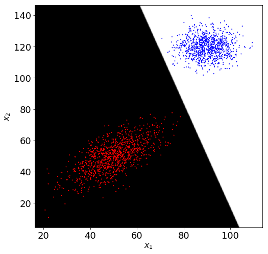

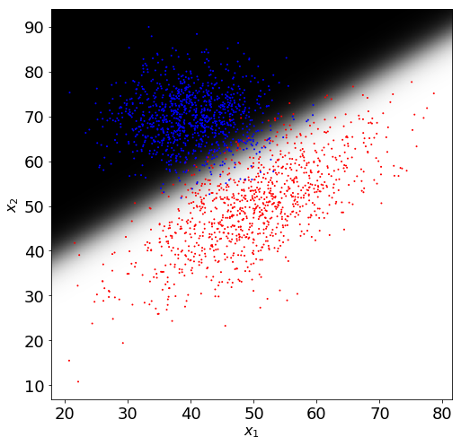

## Regularizace parametrů

## Slide 35

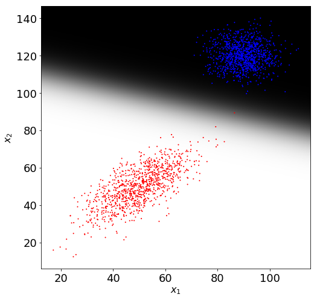

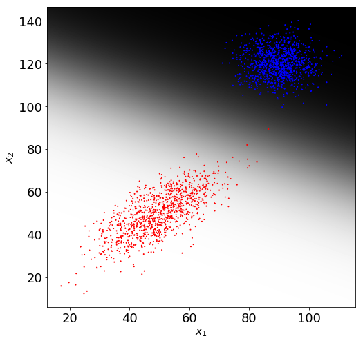

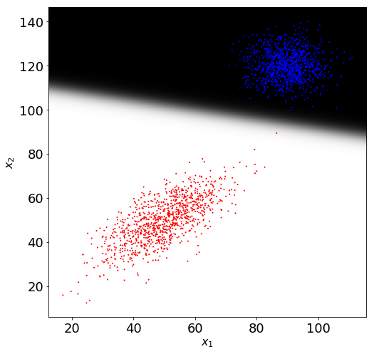

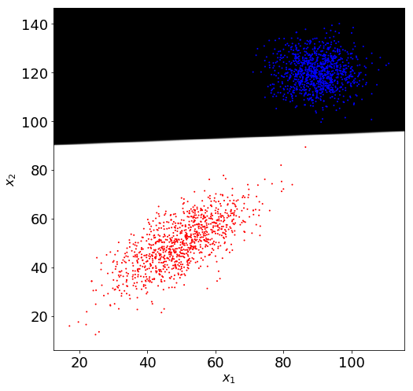

## Nelineární mapování vstupního vektoru

Nelze-li původní data lineárně oddělit, možná pomůže jejich nelineární transformace do potenciálně vysocerozměrného prostoru – hlavní myšlenka „kernel methods“ které  budou vysvětleny příště

V našem příkladu pomohlo i mapování dvourozměrných dat do dvou gaussovských funkcí

## Lineární logistická regrese: nelineární klasifikace

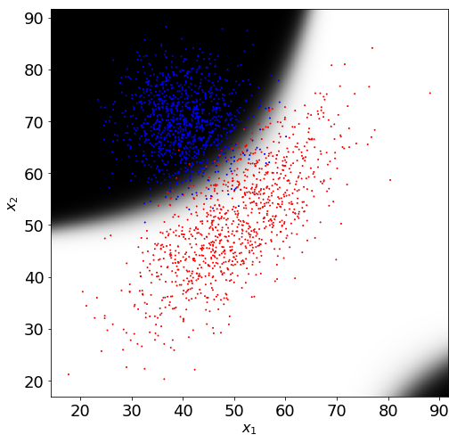
