# statistical models for automatic speech recognition

- Source: [statistical_models_for_automatic_speech_recognition.pptx](../../../raw/sur-prednasky/06_hmm/statistical_models_for_automatic_speech_recognition.pptx)
- URL: https://www.fit.vut.cz/study/course/SUR/public/prednasky/06_hmm/statistical_models_for_automatic_speech_recognition.pptx

## Slide 1

Statistical Models for Automatic Speech Recognition

Luk áš  Burget

## Basic rules of probability theory

Sum rule :

Product rule :

Bayes rule :

## Continuous random variables

P ( x )  – probability

p ( x )  – probability density function

Sum rule :

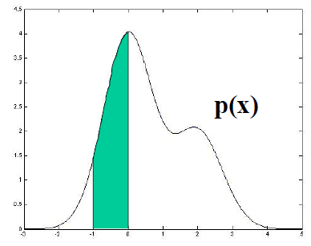

p( x )

-    x

## Speech recognition problem

Feature extraction : preprocessing speech signal to satisfy needs of the following recognition process (dimensionality reduction, preserving only the “important” information, decorrelation).

Popular features are MFCC: modification based on psycho-acoustic findings applied to short-time spectra.

For convenience, we will use one-dimensional features in most of our examples (e.g. short time energy).

## Classifying speech frame

unvoiced

voiced

-    x

<!-- -->

-   p ( x )

## Classifying speech frame

unvoiced

voiced

Mathematically, we ask the following question:

But the value we read from probability distribution is  p ( x \| class ) .

According to Bayes Rule, the above can be  revritten  as:

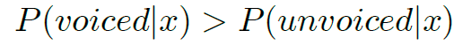

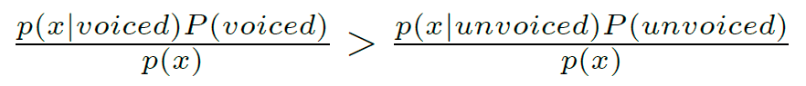

-    x

<!-- -->

-   p ( x )

## Multi-class classification

unvoiced

voiced

silence

The class being correct with the highest probability is given by:

But we do not know the true distribution, …

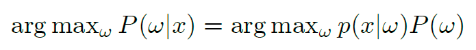

-    x

<!-- -->

-   p ( x )

## Estimation of parameters

… we only see some training examples.

-   p ( x )

<!-- -->

-    x

## Estimation of parameters

… we only see some training examples.

Let’s decide for some parametric model (e.g. Gaussian distribution) and estimate its parameters from the data.

Here, we are using the  frequentist approach : Estimate and rely on distributions, which tells us how frequently we have seen similar feature  x  for individual classes.

-    x

<!-- -->

-   p ( x )

## Maximum Likelihood Estimation

In the next part, we will use ML estimation of model parameters:

This allow as to individually estimate parameters,  Θ ,  of each class given the data for that class. Therefore, for the convenience, we can omit the class identities  in the following equations.

The models we are going to examine are:

Single Gaussian

Gaussian Mixture Model (GMM)

Hidden Markov Model

We want to solve three fundamental problems:

Evaluation of the model (computing likelihood of features given the model)

Training the model (finding ML estimates of parameters)

Finding most likely values of hidden parameters

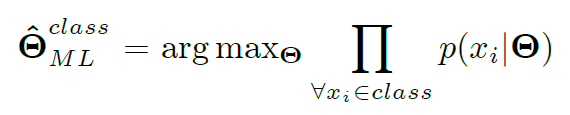

## Gaussian distribution  (univariate)

ML estimates of parameters

## Why Gaussian distribution?

Naturally occurring

Central limit theorem: Summing values of many independently generated random variables gives Gaussian distributed observations

Examples:

Summing outcome of N dices

Galton’s board https://www.youtube.com/watch?v=03tx4v0i7MA

## Gaussian distribution (multivariate)

ML odhad of parametrů:

## Gaussian Mixture Model (GMM)

where

We can see the sum above just as a function defining the shape of the probability density function

or …

## Gaussian Mixture Model

x

## Training GMM –Viterbi training

Intuitive and Approximate iterative algorithm for training GMM parameters.

- Using current model parameters, let Gaussians to classify data as the Gaussians were different classes (Even though the both data and all components corresponds to one class modeled by the GMM)

<!-- -->

- Re-estimate parameters of Gaussian using the data associated with to them in the previous step.

<!-- -->

- Repeat the previous two steps until the algorithm converge.

## Training GMM – EM algorithm

## GMM to be learned

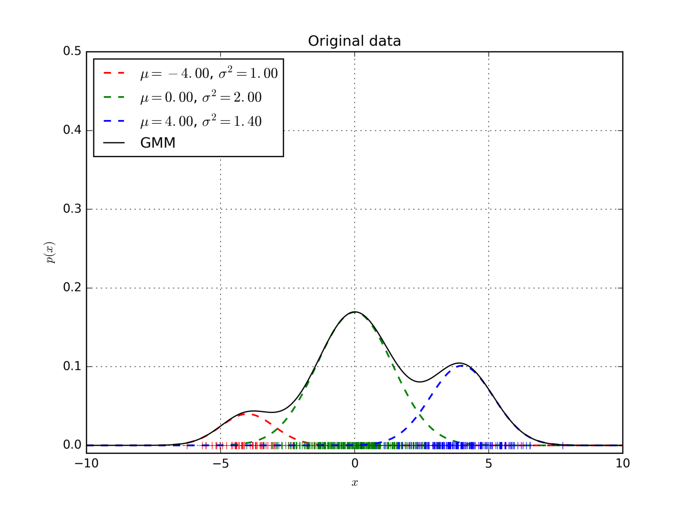

## EM algorithm

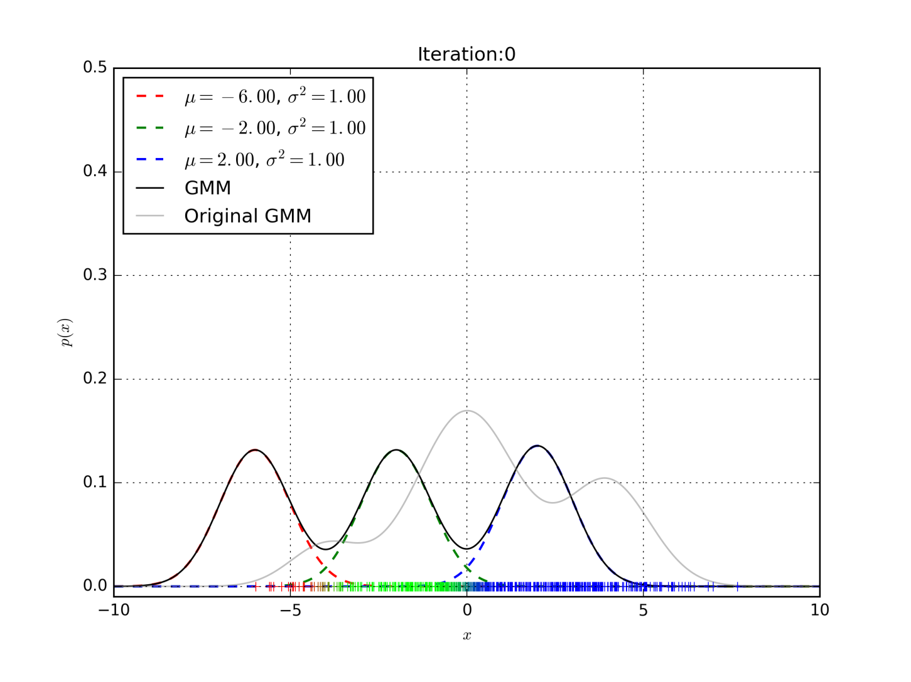

## EM algorithm

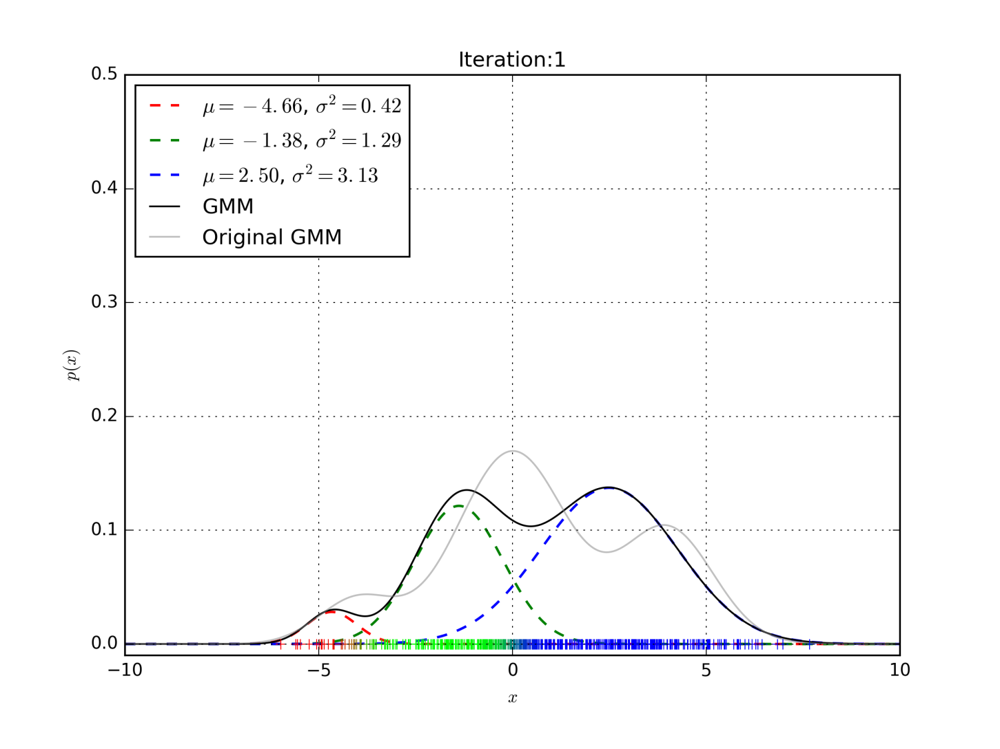

## EM algorithm

## EM algorithm

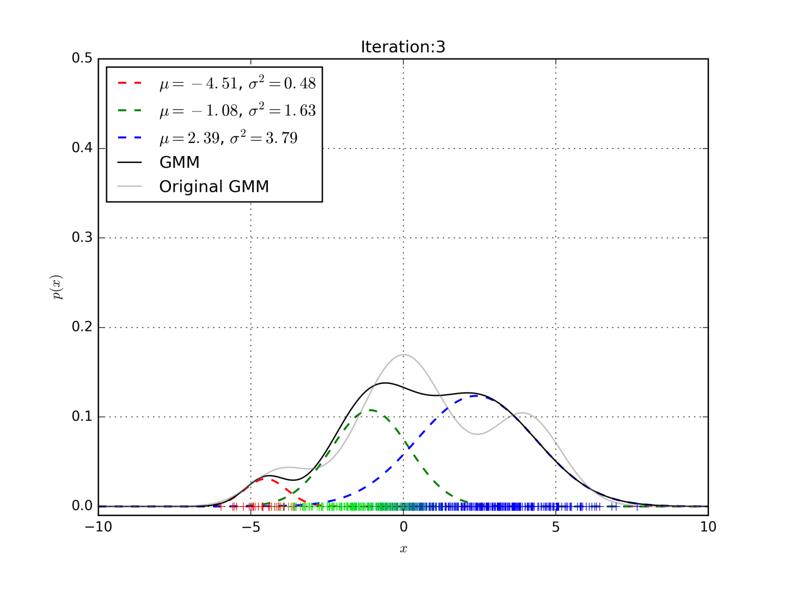

## EM algorithm

## EM algorithm

## EM algorithm

## EM algorithm

## EM algorithm

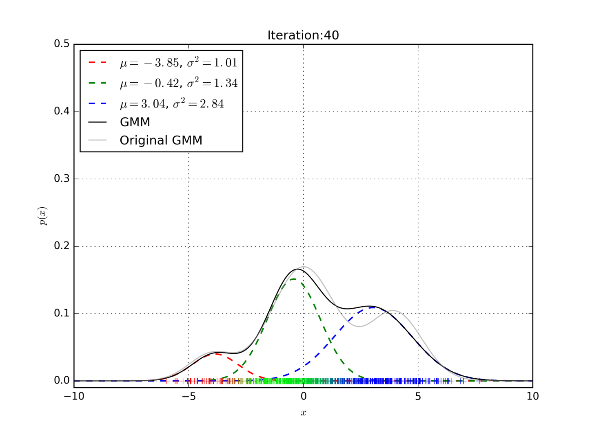

## EM algorithm

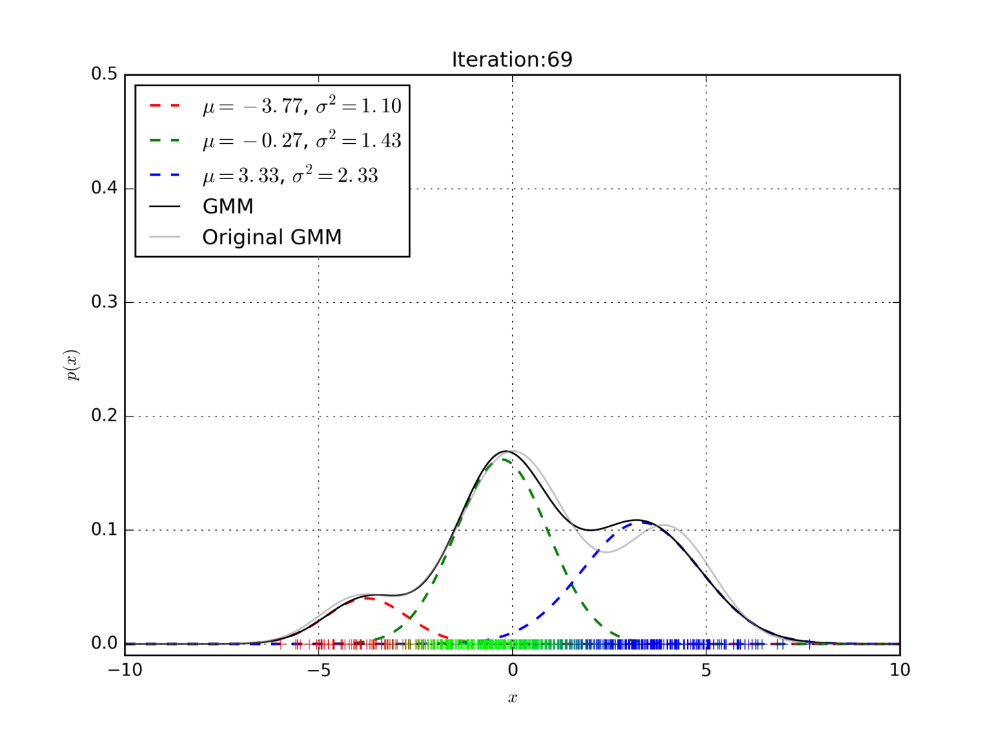

## Classifying stationary sequence

Frame independency assumption

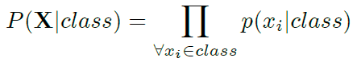

## Modeling more general sequences: Hidden Markov Models

Generative model: For each frame, model moves from one state to another according to a transition probability a ij  and generates feature vector from probability distribution b j (.) associated with the state that was entered.

To evaluate such model, we do not see which path through the states was taken.

Let’s start with evaluating HMM for a particular state sequence.

a 01 = 1

## Slide 31

a 11

a 22

a 33

a 12

a 3exit

a 23

b 1 ( x )

b 2 ( x )

b 3 ( x )

a 11

a 12

a 23

a 33

P( X,S) =

b 1 (x 1 )

b 1 (x 2 )

b 2 (x 3 )

b 3 (x 4 )

b 3 (x 5 )

a 11

a 12

a 23

a 33

b 1 (x 1 )

b 1 (x 2 )

b 2 (x 3 )

b 3 (x 4 )

b 3 (x 5 )

a 01 = 1

a 01

a 3exit

## Evaluating HMM for a particular state sequence

## Evaluating HMM for a particular state sequence

## Slide 34

## Slide 35

## Slide 36

## Slide 37

.

## Slide 38

.

## Slide 39

.

## Evaluating HMM (for any state sequence)

Since we do not know the underlying state sequence, we must marginalize – compute and sum likelihoods over all the possible paths

## Slide 41

## Slide 42

## Slide 43

## Slide 44

## Slide 45

## Finding the best (Viterbi) paths

## Training HMMs – Viterbi training

Similar to the approximate training we have already seen for GMMs

For each training utterance find Viterbi path through  H MM , which associate feature frames with states.

Re-estimate state distribution using associated feature frames.

Repeat steps 1. and 2. until the algorithm converges.

## Training HMMs using EM

t

s

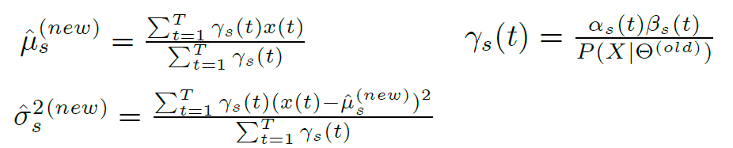

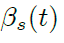

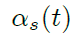

## Isolated word recognition

YES

NO

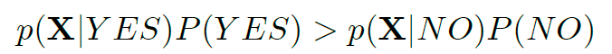

## Connected word recognition

YES

NO

sil

sil

See what words were traversed by the Viterbi path

## Phoneme based models

y

eh

s

y

eh

s

## Using Language model - unigram

w

ah

n

t

uw

th

r

iy

one

two

three

sil

sil

P(one)

P(three)

P(two)

## Using Language model - bigram

ah

n

sil

uw

sil

r

iy

sil

one

two

three

w

t

th

P(W 2 \|W 1 )

one

three

two

## Other basic ASR topics not covered by this presentation

Context dependent models

Training phoneme based models

Feature extraction

Delta parameters

De-correlation of features

Full-covariance vs. diagonal cov. modeling

Adaptation to speaker or acoustic condition

Language Modeling

LM smoothing (back-off)

Discriminative training (MMI or MPE)

and so on
