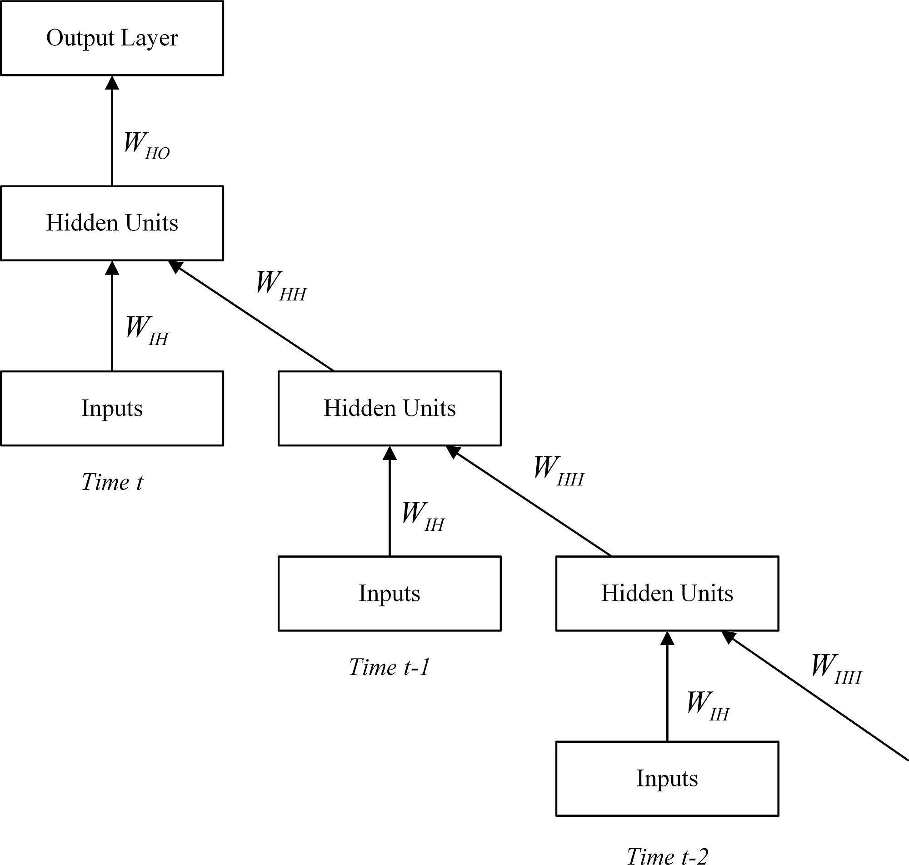
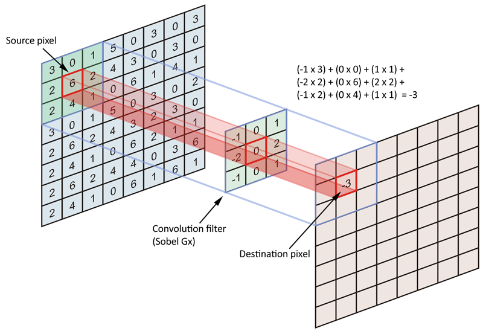
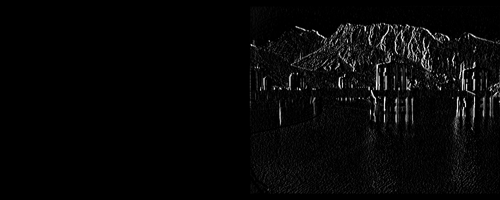
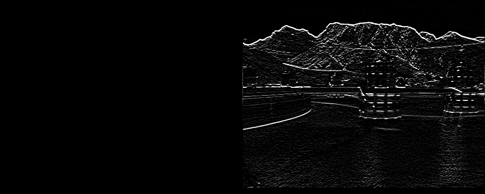
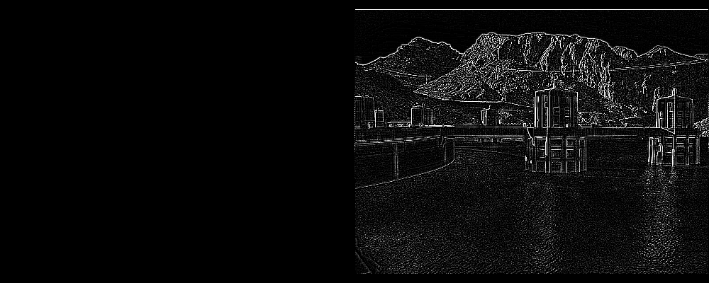
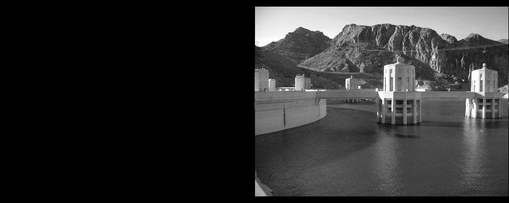
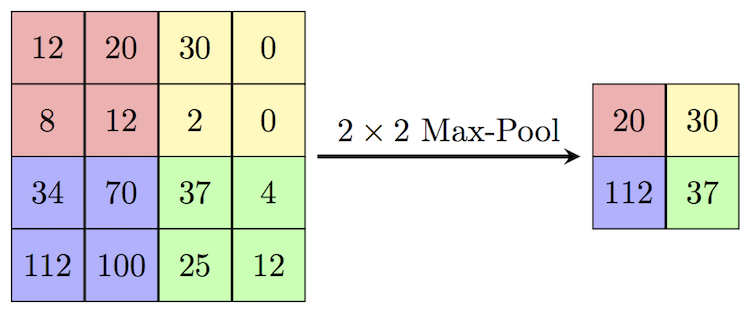
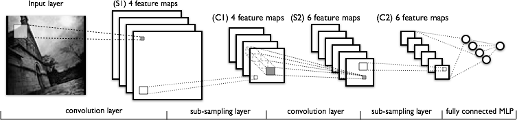

# NN CNN SVM

- Source: [NN_CNN_SVM.pptx](../../../../raw/sur-prednasky/IKR/05_nn_svm/NN_CNN_SVM.pptx)
- URL: https://www.fit.vut.cz/study/course/SUR/public/prednasky/IKR/05_nn_svm/NN_CNN_SVM.pptx

## Klasifikace a rozpoznávání

Umělé neuronové sítě  a Support Vector Machines

## Lineární klasifikátory

- Nevýhoda: pouze lineární rozhodovací hranice
- Možné řešení:

<!-- -->

- Použít jiný než lineární klasifikátor (např. GMM)
- Nelineární transformace vstupních vektorů:

- Postavit hierarchii lineárních klasifikátorů

\[Graphic: other: http://schemas.openxmlformats.org/presentationml/2006/ole\]

Ale jakou transformaci použít ?

Σ

f(.)

y

x 1

x 2

w 1

w 2

b

a

## Hierarchie lineárních   klasifikátorů

- Napřed natrénujeme modrý a zelený klasifikátor tak aby oddělily každý cluster modrých dat od zbytku.

<!-- -->

- Potřebujeme supervizi: Které modré data patří do kterého clusteru?
-

<!-- -->

- Pak natrénujeme červený klasifikátor na pravděpodobnostních výstupech modrého a zeleného klasifikátoru

x 2

x 1

h 2

h 1

- 

## Neuronové sítě pro klasifikaci

- Takovýto hierarchický klasifikátor můžeme trénovat jako celek bez nutnosti předchozí supervize.
- Jedná se o jednoduchou neuronovou síť (Neural Network) pro binární klasifikační problém
- „Klasifikátory“ v první vrstvě

<!-- -->

- se mají samy naučit jaké clustery je v datech třeba identifikovat, aby finální lineární klasifikátor mohl oddělit třídy.
-  lze vidět jako nelineární transformaci do prostoru, kde jsou třídy dobře lineárně separovatelné.
- představují tzv.  skrytou vrstvu

## Slide 5

Zjednodušená abstrakce fyzického neuronu, inspirace v přírodě

Zdroj ilustrace: wikipedia

Σ

f(.)

y

x 1

x 2

w 1

w 2

a

b

Neuron a jeho matematický model

## Slide 6

- Uvažujme jednoduchý případ binárního klasifikátoru. Stejně jako u logistické regrese použijeme jako objektivní funkci pravděpodobnost, že všechny trénovací vstupní vektory  x n  jsou rozpoznány správně:

- Kde  y n  je pravděpodobnost třidy C 1 predikovaná výstupem neuronové sítě pro vzor  x n .  t  je vektor korektních identit tříd:  t n   = 1  resp. t n   = 0,   pokud   x n   paří do třídy  C 1  resp. C2.
- Opět se nám bude lepe pracovat se (záporným) logaritmem této objektivní funkce, tedy  vzájemnou entropii :
-

-
- Opět budeme parametry (váhy neuronové sítě) optimalizovat pomoci metody  gradient descend :

\[Graphic: other: http://schemas.openxmlformats.org/presentationml/2006/ole\]

Trénování neuronové sítě

## Zpětné šíření chyby

Potřebujeme vypočítat gradient chyby:

(zde jsou vzorce jen pro jeden vzor trénovacích dat)

Nejprve určíme gradient vah mezi skrytou a výstupní vrstvou:

Zde předpokládáme, že všechny aktivační funkce jsou logistické sigmoidy

f( a )  =  σ ( a )  a v íme,ze derivace  σ ’ ( a )  =  σ ( a )   (1 -  σ ( a ))  = y  (1  - y ) .

\[Graphic: other: http://schemas.openxmlformats.org/presentationml/2006/ole\]

\[Graphic: other: http://schemas.openxmlformats.org/presentationml/2006/ole\]

\[Graphic: other: http://schemas.openxmlformats.org/presentationml/2006/ole\]

Řetězové pravidlo: chyba  E  je složená funkce závislá

na váze  w m , j   přes aktivaci  a 3   a  výstup  y

Dosazením pak dostaneme

\[Graphic: other: http://schemas.openxmlformats.org/presentationml/2006/ole\]

Takzvaná  chyba  na výstupu

## Zpětné šíření chyby II

Nyní určíme gradient vah mezi vstupní a skrytou vrstvou:

\[Graphic: other: http://schemas.openxmlformats.org/presentationml/2006/ole\]

\[Graphic: other: http://schemas.openxmlformats.org/presentationml/2006/ole\]

Opět řetězové pravidlo: chyba  E  je složená funkce závislá  na váze  w j , n   přes aktivaci  a j   a  výstup  h j   první vrstvy a dále přes aktivaci  a 3   a  výstup druhé vrstvy

\[Graphic: other: http://schemas.openxmlformats.org/presentationml/2006/ole\]

Podobným výpočtem jako pro výstupní vrstvu a využitím už spočítaného  δ 3 :

Chyba na výstupu  δ 3  se  zpětně se propaguje  do „ chyby“  ve skryte vrsve  δ k

## Zpětné šíření chyby I I I

V obecném případě kdy má neuronová sít více výstupů y m  (např. pro více tříd) bude mít chyba :  δ k  složitější tvar:

\[Graphic: other: http://schemas.openxmlformats.org/presentationml/2006/ole\]

Protože všechny výstupy sítě závisí na hodnotě  skryté vrstvy  h k , sčítáme parciální

derivace ze všech neuronů další vrstvy. Výraz  δ m   = y m   -   t m    je chyba na  m -tém výstupu .

Ob dobně se chyba  δ k   může zpětně šířit do předešlých vrstev, pokud by neuronová síť měla skrytých vrstev více.

Σ

w 11

w 31

b 4

𝜎(.)

h 1

x 1

w 12

a 1

Σ

h 2

x 2

a 2

w 21

w 22

Σ

y 1

w 32

a 3

b 1

b 2

b 3

E

t

Σ

𝜎(.)

w 41

w 42

a 4

y 2

## Úprava vah

Úpravu vah lze provádět:

 po předložení všech vektorů trénovací sady ( batch training )

-  gradienty pro jednotlivé vzory z předchozích slajdů se akumulují
-  pomalejší konvergence, nebezpečí uvíznutí v lokálním minimu

po každém vektoru ( Stochastic-Gradient Descent)

-  rychlejší postup trénování při redundantních trénovacích datech
-  riziko přetrénování na posledních pár vektorů z trénovací sady
-  data je lepší předkládat v náhodném pořadí

3. po předložení několika vektorů ( mini-batch training )

\[Graphic: other: http://schemas.openxmlformats.org/presentationml/2006/ole\]

## Ochrana proti přetrénování

- Rozdělení dat: trénovací, cross-validační, testovací sada
- Algoritmus New-Bob (simulované žíhání):

proveď jednu iteraci trénovaní

zjisti úspěšnost NN na CV sadě

		- pokud přírůstek je menší než 0.5 % ,  sniž „teplotu“  є o 1/2

		- pokud přírůstek opětovně menší než 0.5 % , zastav 	trénování

3.   jdi na 1.

- Síť s menším počtem parametrů, úzkým hrdlem
- Regularizace vah (weight-decay): do objektivní funkce přidáme výraz který penalizuje váhy s velkou kladnou či zápornou hondotou)

Učící krok є můžeme interpretovat jako teplotu, s nižší teplotou klesá

pohyblivost vah podobně jako je tomu u molekul plynu.

## Normalizace dat

- Transformujeme náhodné proměnné X, tak aby platilo:  	E\[X\] = 0;  D\[X\] = 1
- Dynamický rozsah hodnot se přizpůsobí dynamickému rozsahu vah

\[Graphic: other: http://schemas.openxmlformats.org/presentationml/2006/ole\]

bez normalizace

\[Graphic: other: http://schemas.openxmlformats.org/presentationml/2006/ole\]

\[Graphic: other: http://schemas.openxmlformats.org/presentationml/2006/ole\]

## Varianty neuronových síťí

- Umělé neuronové sítě mohou mít více než jednu skrytou vrstvu:

<!-- -->

- Současný trend pro large-scale problémy (rozpoznávání řeči či obrazu) jsou hluboké sítě (Deep Neural Networks) s několika ( typicky   do  10 ) vrstvami a až desítky tisíc neuronů (miliony trénovatelných vah)
-

<!-- -->

- Neuronovou síť lze použít pro jiné problémy než binární klasifikace:

	Regrese

- Neunorová síť muže aproximovat libovolnou (M-dimensionální) nelineární funkci
- Typicky je použita lineární (či-li žádná) aktivační funkce na vytupu NN.
- Objektivní funkce je typicky  Mean Squared Error  (pro N vzoru a M výstupů):

<!-- -->

-

	Klasifikace do více tříd:

- Muticlass cross-entropy obektivní  funkce:
-

	kde t n,m , je 1 pokud n-tý vzor patří do m-té třídy, jinak je 0.

- Softmax nelinearita na výstupu zaručí, že výstupem jsou normalizované posteriorní pravděpodobnosti říd:

\[Graphic: other: http://schemas.openxmlformats.org/presentationml/2006/ole\]

\[Graphic: other: http://schemas.openxmlformats.org/presentationml/2006/ole\]

\[Graphic: other: http://schemas.openxmlformats.org/presentationml/2006/ole\]

## Dopředna klasifikační neuronová síť pro více tříd

## Rekurentní neuronová síť

## Zpětná propagace časem

## Konvoluční neuronové sítě

- CNN je obvyklá architektura pro rozpoznávání obrázků
- Berou v úvahu to jak jednotlive vstupy neuronové sítě (pixely obrázku) leží vedle sebe.
- Sdílení vah pro různé pozice v obrázku    invariance vůči translaci obrázku.

Diskrétní konvoluce

2d  konvoluce

## 2d  konvoluce

## Konvoluč n í   filtry

| -1  | 0   | 1   |
|-----|-----|-----|
| -2  | 0   | 2   |
| -1  | 0   | 1   |

| 1   | 2   | 1   |
|-----|-----|-----|
| 0   | 0   | 0   |
| -1  | -2  | -1  |

| -1  | -1  | -1  |
|-----|-----|-----|
| -1  | 8   | -1  |
| -1  | -1  | -1  |

| 0   | 0   | 0   |
|-----|-----|-----|
| 0   | 1   | 0   |
| 0   | 0   | 0   |

- Konvoluční vrstva aplikuje několik konvolučních filtru jejichž váhy se v rámci trénování CNN učíme.
- Výsledkem je několik hladin  ( replik )  obrázku (tzv. feature maps)
- Na výsledné obrázky se jestě pixel po pixelu aplikuje nelinearita :  např .  sigmoida nebo  ReLU(a ) = max(0,a)

## Pooling

- Pooling  vrstva provede podvzorkování obrázku
- Např Max-pooling nahradí každou čtverici pizeků pouze jejich maximalní hodnotou    zredukuje onrázek na poloviční velikost

## Kompletní CNN

- CNN  střídá konvolučni a pooling vrstvy
- Na konci se většinou objevi obvyklá plně propojená hladina
-
-
-
-
-
-

- Konvoluční filtry v pozdějších vrstvách mají tvar  3D  matic   tak a by  operovaly nad   všemi  “ feature maps ” . Filtry se ale pohybuji jen ve dvou dimenzich:
-
-
-
- Pro barevné obrázky   operuje i prvni konvoliční vrstva nad třemi barevnými hladinami (RGB feature maps)

## Slide 22

Support Vector Machines

## Support Vector Machines

- SVM lineární klasifikátor s specifickou objektivní funkci: maximum margin

- V základní variantě zvládne pouze dvě nepřekrývající se lineárně separovatelné třídy

\[Graphic: other: http://schemas.openxmlformats.org/presentationml/2006/ole\]

## SVM kritérium

- Maximalizuje mezeru  (margin)  mezi dvěmi shluky dat

D

R

## Lineární klasifikátor

.

\[Graphic: other: http://schemas.openxmlformats.org/presentationml/2006/ole\]

\[Graphic: other: http://schemas.openxmlformats.org/presentationml/2006/ole\]

## Lineární klasifikátor

.

\[Graphic: other: http://schemas.openxmlformats.org/presentationml/2006/ole\]

- Rozhodněme, že margin bude dán prostorem mezi přímkami y=-1 a y=1
- Co se stane, když zkrátíme vektor  w ?

## Lineární klasifikátor

.

\[Graphic: other: http://schemas.openxmlformats.org/presentationml/2006/ole\]

- Rozhodněme, že „margin“ bude dán prostorem mezi přímkami y=-1 a y=1
- Co se stane, když zkrátíme vektor  w ?  Margin se zvětší !
- Budeme hledat řešeni, kde  w  je co nejkratší a kde „margin“ odděluje data obou tříd.

## Trénování SVM

- Minimalizujeme:
-
-
- S podmínkami:
-
-
- N  je počet trénovacích vektorů a                  udávají třídy pro jednotlivá trénovací data.
-
- Jedná se o problém tzv. kvadratického programování, což je speciální případ   optimalizace s omezením ( constrained optimization ) .

\[Graphic: other: http://schemas.openxmlformats.org/presentationml/2006/ole\]

\[Graphic: other: http://schemas.openxmlformats.org/presentationml/2006/ole\]

\[Graphic: other: http://schemas.openxmlformats.org/presentationml/2006/ole\]

\[Graphic: other: http://schemas.openxmlformats.org/presentationml/2006/ole\]

## Co jsou to Support Vectors ?

- Podpůrné vektory (support vectors) leží na okraji prázdné oblasti a přímo ovlivňují řešení
- K dyby se ostatní data vypustila z   trénovacího setu, výsledek by se nezměnil
-

x 1

x 2

\`

\`

\`

x 1

x 2

\`

\`

.

## Řešení

- Normálový vektor w definující rozhodovací hranici lze sestavit lineární kombinaci podpůrných vektoru:

- Tato reprezentace umožňuje klasifikaci bez explicitního vyjádření vektoru  w :
-
-
-
- Podobně i vstupem do trénovacíhi mohou  být  skalární součiny mezi trénovacími daty    možnost použití následujícího „ kernel triku “.

\[Graphic: other: http://schemas.openxmlformats.org/presentationml/2006/ole\]

\[Graphic: other: http://schemas.openxmlformats.org/presentationml/2006/ole\]

\[Graphic: other: http://schemas.openxmlformats.org/presentationml/2006/ole\]

## Lineárně neseparovatelná úloha

- Může být řešena nelineárním mapováním dat              do nového prostoru (s více dimenzemi)
-
-
-
-
-
-
-
- Pro SVM potřebujeme v novem prostoru spočítat skalární součin mezi jakýmikoli dvěma mapovanými vektory.
- To lze často udělat efektivněji bez explicitního mapovaní do noveho prostoru pomoci tzv. jádrové funkce (kernel function)

\[Graphic: other: http://schemas.openxmlformats.org/presentationml/2006/ole\]

\[Graphic: other: http://schemas.openxmlformats.org/presentationml/2006/ole\]

\[Graphic: other: http://schemas.openxmlformats.org/presentationml/2006/ole\]

\[Graphic: other: http://schemas.openxmlformats.org/presentationml/2006/ole\]

## Příklady jader

- Polynomiální jádro:

<!-- -->

- Přiklad pro jednorozměrná data a  d =2
-
-
- Což odpovídá skalárnímu součinu po mapování:
-
-

<!-- -->

- Radiální bázove funkce:
-
-

<!-- -->

- Odpovídají skalárnímu součinu po projekci do jistého nekonečně dimensionálního prostoru    vždy separovatelné třídy .

\[Graphic: other: http://schemas.openxmlformats.org/presentationml/2006/ole\]

\[Graphic: other: http://schemas.openxmlformats.org/presentationml/2006/ole\]

\[Graphic: other: http://schemas.openxmlformats.org/presentationml/2006/ole\]

\[Graphic: other: http://schemas.openxmlformats.org/presentationml/2006/ole\]

## Překrývající se třídy

- Pro překrývající třídy uvedené řešení selže.
- Zavádějí se proměnné (slack variables), které oslabí omezující podmínky

x 1

x 2

ξ i

## Překrývající se třídy II

- Minimalizujeme

- S podmínkami:

- První výraz maximalizuje mezeru (margin) mezi třídami a druhý penalizuje vzory porušující tento margin.
- C  řídí kompromis mezi oběma výrazy. C  ∞  odpovídá originální variantě pro separovatelná data.

\[Graphic: other: http://schemas.openxmlformats.org/presentationml/2006/ole\]

\[Graphic: other: http://schemas.openxmlformats.org/presentationml/2006/ole\]

\[Graphic: other: http://schemas.openxmlformats.org/presentationml/2006/ole\]

\[Graphic: other: http://schemas.openxmlformats.org/presentationml/2006/ole\]

## Vlastnosti a použití SVM

- Výstup SVM nemá pravděpodobnostní interpretaci.

<!-- -->

- nepredikuje pravděpodobnost tříd pro daný vstup
- produkuje ale měkké skóre, které lze přibližně na „pravděpodobnost tříd y “ převést.
- Objektivní funkce má blíže k  maximalizaci počtu správně rozpoznaných  než k  maximalizaci  pravděpodobnost že vše je rozpoznáno dobře  (objektivní  funkce logistické regrese).
-

<!-- -->

- Často používaný klasifikátor pro problémy se dvěma třídami.

<!-- -->

- Rozšíření na více tříd je možné, ale ne tak přímočaré jako u pravděpodobnostních klasifikátorů.
-

<!-- -->

- Hlavní výhoda oproti např. logistické regresi je možnost implicitní nelineární transformace vstupů pomoci jader.

<!-- -->

- Společná vlastnost všech jádrových metod (Kernel methods).

## Software

- Existuje velni dobrá knihovna LibSVM

   http://www.csie.ntu.edu.tw/~cjlin/libsvm/

- Funkce v Matlabu:

<!-- -->

- svmtrain, svmclassify
